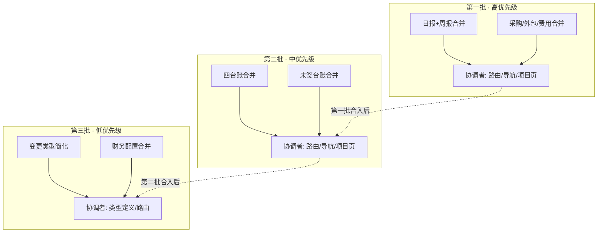
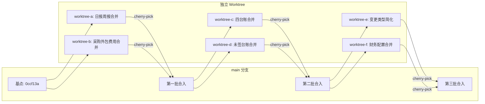

# 业务冗余优化 — 多 Agent 协作执行方案

> 基于 `docs/业务冗余优化方案.md` 的 6 项优化，按三批并行执行。

---

## 1. 当前状态

- **分支**: `main`（干净工作区）
- **基点**: `0ccf13a` — fix: Issues #2 #3 #4
- **项目进度**: 51/72 页面已验收（JS 0/13、CF 0/8 待验收）
- **优化范围**: 纯重构，不新增页面，不影响验收计数

---

## 2. 团队分工

| 角色 | 职责 | 可写范围 |
|------|------|----------|
| **协调者 M** | 共享文件（路由聚合、manifest、navigation、ProjectOverviewPage）、合入队列、工程检查、最终验收 | 集成目录；`src/routes/index.tsx`、`src/routes/navigation.ts`、`src/routes/manifest.ts`、`src/pages/execution/ProjectOverviewPage.tsx` |
| **开发者 A** | 第一批：日报+周报合并 | 见各包 owned_paths |
| **开发者 B** | 第一批：采购/外包/费用合并 | 见各包 owned_paths |
| **开发者 C** | 第二批：四台账合并 | 见各包 owned_paths |
| **开发者 D** | 第二批：未签台账合并 | 见各包 owned_paths |
| **开发者 E** | 第三批：变更类型简化 | 见各包 owned_paths |
| **开发者 F** | 第三批：财务配置合并 | 见各包 owned_paths |

> 实际席位按可用 agent 数量调整：最少 1 协调 + 2 开发（第一批并行），最多 1 协调 + 4 开发（两批并行）。

---

## 3. 批次与依赖关系



**关键规则**:
- 每批内两个任务互不依赖，可完全并行
- 每批之间串行（合入 + 回归后再启动下一批）
- 协调者负责所有共享文件的修改，开发者不碰共享文件

---

## 4. 任务包详情

### 4.1 第一批：日报 + 周报合并（开发者 A）

**owned_paths**:
- `src/pages/execution/ReportsPage.tsx` — 重构：添加 Tab 切换（日报/周报），替代 `weekly` prop
- `src/mock/reports.ts` — 工具函数调整（如有需要）
- `src/mock/business-domain.ts` — 数据模型合并（可选：统一 `DailyReport`/`WeeklyReport`）

**不做**:
- ❌ 不修改 `src/routes/index.tsx`（协调者处理）
- ❌ 不修改 `src/routes/navigation.ts`（协调者处理）
- ❌ 不修改 `src/routes/manifest.ts`（协调者处理）
- ❌ 不修改 `src/pages/execution/ProjectOverviewPage.tsx`（协调者处理）

**验收标准**:
- [ ] 日报和周报可在同一页面通过 Tab 切换
- [ ] 日报填报功能正常（保存草稿、提交）
- [ ] 周报上报功能正常（生成草稿、补充上报）
- [ ] 历史日报和周报数据可正常查看
- [ ] 里程碑实际达成登记功能正常
- [ ] `pnpm typecheck` ✅、`pnpm lint` ✅、`pnpm build` ✅

**接口约定**（开发者 A 提交接口说明给协调者）:
- 新路由路径：`/projects/:id/reports`（替代 `daily-reports` 和 `weekly-reports`）
- Tab 参数：`?tab=daily` 或 `?tab=weekly`
- 组件导出：`ReportsPage` 不再接受 `weekly` prop

---

### 4.2 第一批：采购 / 外包 / 费用合并（开发者 B）

**owned_paths**:
- `src/pages/execution/CostSourcesPage.tsx` — 重构：添加 Tab 切换（采购/外包/费用）+ 顶部汇总卡片
- `src/mock/cost-orders.ts` — 工具函数调整（如有需要）

**不做**:
- ❌ 不修改 `src/routes/index.tsx`（协调者处理）
- ❌ 不修改 `src/routes/navigation.ts`（协调者处理）
- ❌ 不修改 `src/routes/manifest.ts`（协调者处理）
- ❌ 不修改 `src/pages/execution/ProjectOverviewPage.tsx`（协调者处理）

**验收标准**:
- [ ] 采购/外包/费用可在同一页面通过 Tab 切换
- [ ] 顶部显示三种成本的汇总统计（预算、已发生、承诺、可用）
- [ ] 新建申请时自动选择当前 Tab 对应的类型
- [ ] 各类型的审批流程正常（财务审批、履约验收、入账）
- [ ] `pnpm typecheck` ✅、`pnpm lint` ✅、`pnpm build` ✅

**接口约定**（开发者 B 提交接口说明给协调者）:
- 新路由路径：`/projects/:id/costs`（替代 `procurement`、`outsourcing`、`expenses`）
- Tab 参数：`?kind=procurement`、`?kind=outsource`、`?kind=expense`
- 组件导出：`CostSourcesPage` 不再接受 `kind` prop（或通过 URL 参数读取）

---

### 4.3 第二批：四台账合并（开发者 C）

**owned_paths**:
- `src/pages/tickets/TicketsPage.tsx` — 重构：添加四个 Tab（需求/BUG/问题/风险）+ "全部事项"视图
- `src/pages/tickets/TicketDetailPage.tsx` — 路由调整（统一为 `/tickets/:id`）

**不做**:
- ❌ 不修改 `src/routes/index.tsx`（协调者处理）
- ❌ 不修改 `src/routes/navigation.ts`（协调者处理）
- ❌ 不修改 `src/routes/manifest.ts`（协调者处理）
- ❌ 不修改 `src/pages/execution/ProjectOverviewPage.tsx`（协调者处理）

**验收标准**:
- [ ] 需求/BUG/问题/风险可在同一页面通过 Tab 切换
- [ ] "全部事项"视图可显示所有类型的事项
- [ ] 新建事项时自动选择当前 Tab 对应的类型
- [ ] 各类型的字段差异（风险的评分、需求的优先级、BUG 的严重程度）正确展示
- [ ] 详情页功能正常（处理、转办、关闭）
- [ ] `pnpm typecheck` ✅、`pnpm lint` ✅、`pnpm build` ✅

**接口约定**（开发者 C 提交接口说明给协调者）:
- 新路由路径：`/tickets`（替代 `requirements-bugs` 和 `issues-risks`）
- 详情路径：`/tickets/:id`（替代 `requirements-bugs/:id` 和 `issues-risks/:id`）
- Tab 参数：`?kind=requirement`、`?kind=bug`、`?kind=issue`、`?kind=risk`
- 组件导出：`TicketsPage` 不再接受 `family` prop

---

### 4.4 第二批：未签台账合并（开发者 D）

**owned_paths**:
- `src/pages/unsigned/UnsignedProjectsPage.tsx` — 简化：改为重定向或嵌入组件
- `src/pages/unsigned/UnsignedProjectPage.tsx` — 简化：提取为可嵌入 Tab 的组件
- `src/pages/unsigned/StartConfirmationPage.tsx` — 不动（已有独立用途）
- `src/mock/unsigned.ts` — 工具函数调整（导出可在项目详情页中使用的组件）

**不做**:
- ❌ 不修改 `src/pages/projects/ProjectLedgerPage.tsx`（协调者处理 — 添加未签筛选）
- ❌ 不修改 `src/pages/execution/ProjectOverviewPage.tsx`（协调者处理 — 添加"未签管控"Tab）
- ❌ 不修改 `src/routes/index.tsx`（协调者处理）
- ❌ 不修改 `src/routes/navigation.ts`（协调者处理）
- ❌ 不修改 `src/routes/manifest.ts`（协调者处理）

**验收标准**:
- [ ] 未签项目详情页功能提取为可复用组件
- [ ] 签约进展更新、追加投入、合同签订确认、退出复盘功能正常
- [ ] 旧路由 `/unsigned-projects` 保留为快捷入口
- [ ] `pnpm typecheck` ✅、`pnpm lint` ✅、`pnpm build` ✅

**接口约定**（开发者 D 提交接口说明给协调者）:
- 导出一个 `UnsignedProjectTab` 组件，可直接嵌入 `ProjectOverviewPage` 的 Tab
- 导出一个 `UnsignedProjectFilter` 组件，可嵌入 `ProjectLedgerPage` 的筛选栏
- 接口：`UnsignedProjectTab({ projectId: string })`、`UnsignedProjectFilter({ onFilter: (isUnsigned: boolean) => void })`

---

### 4.5 第三批：变更类型简化（开发者 E）

**owned_paths**:
- `src/models/types.ts` — 修改 `ProjectChange.type` 定义（六类型→三类型）
- `src/models/changes.ts` — 调整 `ChangeInput` 类型
- `src/pages/changes/ChangeFormPage.tsx` — 更新类型选择器
- `src/mock/changes.ts` — 审批规则调整
- `src/mock/business-domain.ts` — 变更处理逻辑调整

**不做**:
- ❌ 不修改 `src/routes/` 下的文件

**验收标准**:
- [ ] 新建变更时只有三种类型可选
- [ ] 三种类型的审批路径正确
- [ ] 历史变更数据可正常查看（保留原类型）
- [ ] 变更台账和详情页正确显示类型
- [ ] `pnpm typecheck` ✅、`pnpm lint` ✅、`pnpm build` ✅

---

### 4.6 第三批：财务配置合并（开发者 F）

**owned_paths**:
- `src/pages/configuration/FinanceConfigurationPage.tsx` — 重构：添加 Tab 切换（科目映射/成本基准/预警规则）

**不做**:
- ❌ 不修改 `src/routes/modules/configuration-finance.tsx`（协调者处理）
- ❌ 不修改 `src/routes/index.tsx`（协调者处理）
- ❌ 不修改 `src/routes/navigation.ts`（协调者处理）
- ❌ 不修改 `src/routes/manifest.ts`（协调者处理）

**验收标准**:
- [ ] 科目映射/成本基准/预警规则可在同一页面通过 Tab 切换
- [ ] 各配置的版本化管理功能正常
- [ ] 权限控制正确（成本基准仅财务/管理员可见）
- [ ] `pnpm typecheck` ✅、`pnpm lint` ✅、`pnpm build` ✅

**接口约定**（开发者 F 提交接口说明给协调者）:
- 新路由路径：`/settings/finance-config`（替代 `cost-mapping`、`cost-baseline`、`alerts`）
- Tab 参数：`?kind=subjects`、`?kind=rates`、`?kind=alerts`
- 组件导出：`FinanceConfigurationPage` 不再接受 `kind` prop

---

## 5. 协调者工作清单

### 5.1 第一批合入前

为开发者 A 准备：
- [ ] 在 `src/routes/index.tsx` 中添加新路由 `/projects/:id/reports`
- [ ] 保留旧路由 `/projects/:id/daily-reports` 和 `/projects/:id/weekly-reports` 的重定向
- [ ] 在 `src/routes/navigation.ts` 中更新 `globalNavKey` 函数
- [ ] 在 `src/pages/execution/ProjectOverviewPage.tsx` 中合并"日报"和"周报"Tab 为"项目报告"

为开发者 B 准备：
- [ ] 在 `src/routes/index.tsx` 中添加新路由 `/projects/:id/costs`
- [ ] 保留旧路由 `/projects/:id/procurement`、`/projects/:id/outsourcing`、`/projects/:id/expenses` 的重定向
- [ ] 在 `src/pages/execution/ProjectOverviewPage.tsx` 中合并"采购外包"Tab 为"成本管理"

### 5.2 第二批合入前

为开发者 C 准备：
- [ ] 在 `src/routes/index.tsx` 中添加新路由 `/tickets` 和 `/tickets/:id`
- [ ] 保留旧路由 `/requirements-bugs`、`/issues-risks` 的重定向
- [ ] 在 `src/routes/navigation.ts` 中合并菜单项
- [ ] 在 `src/pages/execution/ProjectOverviewPage.tsx` 中合并"问题风险"和"需求BUG"Tab

为开发者 D 准备：
- [ ] 在 `src/pages/projects/ProjectLedgerPage.tsx` 中添加"未签项目"筛选
- [ ] 在 `src/pages/execution/ProjectOverviewPage.tsx` 中添加"未签管控"Tab（使用开发者 D 导出的组件）

### 5.3 第三批合入前

为开发者 F 准备：
- [ ] 在 `src/routes/modules/configuration-finance.tsx` 中添加新路由
- [ ] 在 `src/routes/index.tsx` 中注册新路由
- [ ] 在 `src/routes/navigation.ts` 中合并菜单项

### 5.4 每批合入后

- [ ] 运行 `pnpm typecheck` ✅
- [ ] 运行 `pnpm lint` ✅
- [ ] 运行 `pnpm build` ✅
- [ ] 运行 `pnpm test:domain` ✅
- [ ] 手动验证受影响页面的基本功能
- [ ] 提交合入并推送

---

## 6. Git 工作流



**规则**:
1. 每个开发者从 `main` 的当前基点创建独立 worktree 和分支
2. 开发者只提交自己 owned_paths 内的文件
3. 协调者先在 main 上提交共享文件改动，发布统一同步点
4. 开发者 rebase 到同步点后继续开发
5. 合入时协调者 cherry-pick 开发者的独占提交到 main
6. 每批合入后运行全量工程检查

---

## 7. 执行步骤

### 步骤 1：协调者准备共享接口（第一批）

1. 在 `main` 上创建新分支 `coord-batch1-prep`
2. 修改 `src/routes/index.tsx`：
   - 添加 `/projects/:id/reports` 路由
   - 添加 `/projects/:id/costs` 路由
   - 旧路由保留重定向（或保留不动，由开发者组件自行处理）
3. 修改 `src/pages/execution/ProjectOverviewPage.tsx`：
   - 合并"日报"+"周报"Tab → "项目报告"
   - 合并"采购外包"Tab → "成本管理"
4. 提交并推送，记录提交 hash 作为同步点

### 步骤 2：派发第一批开发者任务

**开发者 A**（日报+周报合并）：
```
workdir: /home/xx/Code/pms-demo-worktree-a
branch:  dev-optimize-reports
起点:    coord-batch1-prep 的同步点
owned:   src/pages/execution/ReportsPage.tsx, src/mock/reports.ts, src/mock/business-domain.ts
任务:    在 ReportsPage.tsx 中添加 Tab 切换（日报/周报），替代 weekly prop
```

**开发者 B**（采购/外包/费用合并）：
```
workdir: /home/xx/Code/pms-demo-worktree-b
branch:  dev-optimize-costs
起点:    coord-batch1-prep 的同步点
owned:   src/pages/execution/CostSourcesPage.tsx, src/mock/cost-orders.ts
任务:    在 CostSourcesPage.tsx 中添加 Tab 切换 + 顶部汇总卡片
```

### 步骤 3：接收第一批交付

1. 开发者 A 和 B 完成开发后提交到各自分支
2. 协调者 cherry-pick 独占提交到 main
3. 运行全量工程检查
4. 手动验证基本功能
5. 标记第一批完成

### 步骤 4-6：重复步骤 1-3 处理第二批、第三批

---

## 8. 风险与缓解

| 风险 | 概率 | 影响 | 缓解措施 |
|------|------|------|----------|
| 共享文件冲突 | 中 | 高 | 协调者独占共享文件，开发者不碰 |
| 旧路由引用遗漏 | 中 | 中 | 合入后全局搜索旧路由路径 |
| 组件接口不兼容 | 低 | 高 | 开发者提交前明确接口约定 |
| 验收页面回归 | 低 | 中 | 合入后运行 `pnpm test:domain` |
| Worktree 磁盘空间 | 低 | 低 | 每批最多 2 个 worktree，用完即删 |

---

## 9. 时间估算

| 批次 | 任务 | 开发 | 协调+合入 | 合计 |
|------|------|------|-----------|------|
| 第一批 | 日报+周报合并 | 1-2h | 0.5h | 1.5-2.5h |
| 第一批 | 采购/外包/费用合并 | 1-2h | 0.5h | 1.5-2.5h |
| 第二批 | 四台账合并 | 1-2h | 0.5h | 1.5-2.5h |
| 第二批 | 未签台账合并 | 1-2h | 0.5h | 1.5-2.5h |
| 第三批 | 变更类型简化 | 0.5-1h | 0.5h | 1-1.5h |
| 第三批 | 财务配置合并 | 0.5-1h | 0.5h | 1-1.5h |
| **总计** | | **5-10h** | **3h** | **8-13h** |

> 并行执行时，第一批约 2h 完成（两个任务并行），第二批约 2h，第三批约 1.5h。总计约 **5-6h 实际耗时**（3 批 × 2h 含合入）。