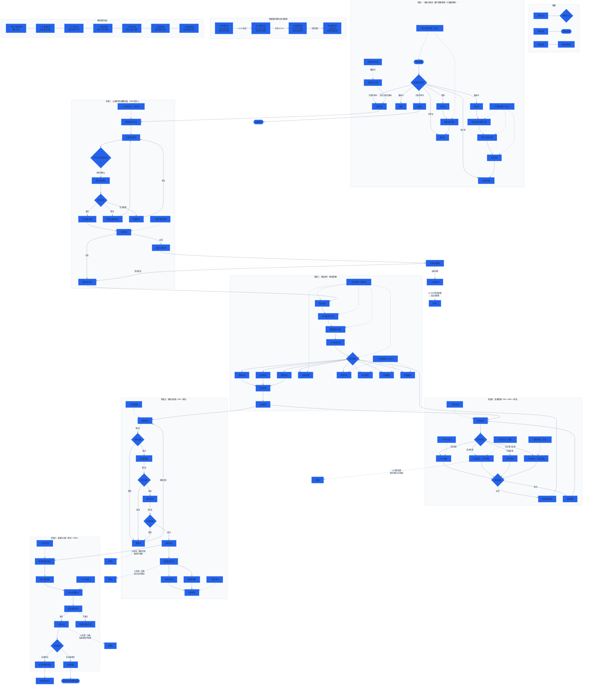

# 项目管理平台 — 全流程业务流图

> 基于系统实际页面与业务逻辑梳理，覆盖全部 7 个角色与四算全生命周期。

---

## 流程说明

### 阶段一：商机与售前
- **起点：** 客户经理/销售创建商机
- **状态流转：** 草稿 → 待评估 → 跟进中 → 暂缓/拟立项 → 方案评审中 → 已转立项/已终止
- **关键活动：** 商机评估、需求方案、技术成本评估、专家评审、提前投入
- **角色：** 客户经理/销售（主导）、方案架构师（技术支持）

### 阶段二：立项评审与概算冻结
- **起点：** 概算冻结 → 立项申请
- **评审流程：** PMO风险评估 → 风险矩阵确认 → 评审决策（通过/整改/否决暂缓）
- **签约：** 已签→进入执行；未签→进入未签立项台账跟踪
- **角色：** PMO负责人（主导）、客户经理/销售（签约）

### 阶段三：项目执行
- **起点：** WBS编制 → 预算编制 → PMO基线冻结
- **执行活动：** 采购/外包/费用申请、日报/周报、需求/BUG/问题/风险
- **成本归集：** 动态核算实时反映
- **角色：** 项目经理（主导）、方案架构师（需求/BUG/问题/风险）

### 阶段四：变更管理
- **变更类型：** 工期变更、成本变更、范围变更、综合重大变更
- **审批链：** PMO审批 / 财务会签+PMO审批 / PMC审议+领导决策
- **结果：** 批准→更新基线；驳回→返回修改
- **角色：** 项目经理（发起）、PMO/财务/集团领导（审批）

### 阶段五：验收与回款
- **验收流程：** 内部初验 → 供应商验收 → 客户终验（支持多轮次+整改）
- **回款：** 合同首付款（已收）→ 验收结算款（待收）
- **角色：** 项目经理（验收）、财务专员（回款核销）

### 阶段六：结算与关闭
- **流程：** 成本锁定 → 财务结算 → PMO确认 → 结算评审 → 项目关闭
- **后续：** 运维项目进入质保期；非运维项目归档
- **角色：** 财务专员（主导）、PMO负责人（确认）

### 四算联动
- **概算（立项前）：** 130,165万元 — 商机毛利基准
- **预算（目标基线）：** 133,002.7万元 — +2.2%偏差
- **核算（实时成本）：** 84,030.5万元 — 消耗63.2%
- **结算（经营锁定）：** 1,390万元 — 最终经营结果

---

## 已识别问题清单

| 编号 | 问题 | 严重度 | 状态 |
|:---:|:---|:---:|:---:|
| 1 | 未签项目超限缺乏自动熔断（10/12超限） | 🟡 | 待处理 |
| 2 | 验收整改→重新验收的闭环路径不清晰 | 🟡 | 待处理 |
| 3 | 验收通过后未自动触发回款计划 | 🟡 | 待处理 |
| 4 | 成本变更缺少财务审批节点 | 🟡 | 待处理 |
| 5 | 结算→运维的衔接机制不明确 | 🟡 | 待处理 |
| — | ~~模拟身份在页面跳转后重置~~ | ~~🔴~~ | ✅ 已修复 |