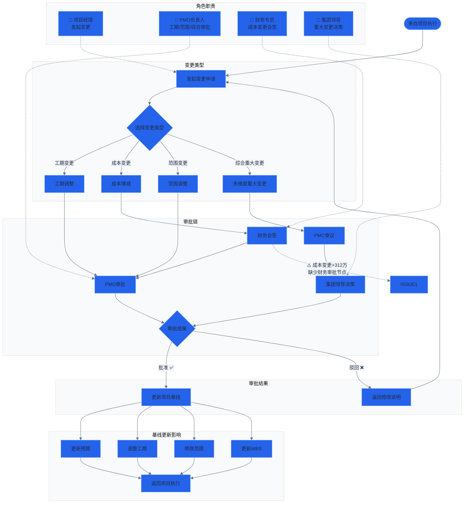

# 流程图 4：变更管理

> 涉及角色：项目经理、PMO负责人、财务专员、集团领导

## 说明

- **变更类型：** 工期变更、成本变更、范围变更、综合重大变更
- **审批链差异：**
  - 工期/范围变更 → PMO 审批
  - 成本变更 → 财务会签 → PMO 审批
  - 综合重大变更 → PMC 审议 → 集团领导决策
- **变更记录：** 系统共 55 项变更，28 项审批中，27 项已批准
- **问题：** 成本变更的财务审批节点在 UI 上未明确展示