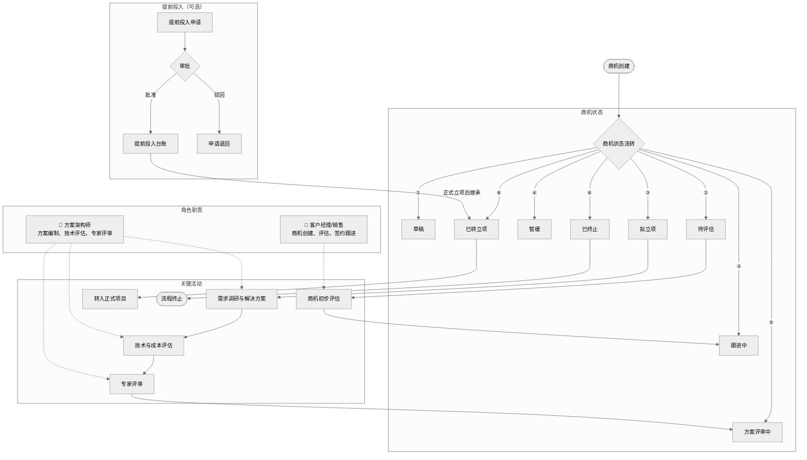

# 流程图 1：商机与售前

> 涉及角色：客户经理/销售（陈亮）、方案架构师（赵工）

```mermaid
%%{init: {'theme': 'neutral', 'themeVariables': {'fontSize': '14px'}}}%%

graph TB
  START(["商机创建"]) --> STATUS{"商机状态流转"}

  subgraph STATUSES["商机状态"]
    direction TB
    STATUS -->|①| S1[草稿]
    STATUS -->|②| S2[待评估]
    STATUS -->|③| S3[跟进中]
    STATUS -->|④| S4[暂缓]
    STATUS -->|③| S5[拟立项]
    STATUS -->|⑤| S6[方案评审中]
    STATUS -->|⑥| S7[已转立项]
    STATUS -->|⑥| S8[已终止]
  end

  subgraph ACTIVITIES["关键活动"]
    direction TB
    S2 --> A1[商机初步评估]
    A1 --> S3

    S5 --> A2[需求调研与解决方案]
    A2 --> A3[技术与成本评估]
    A3 --> A4[专家评审]
    A4 --> S6

    S7 --> A5[转入正式项目]
    S8 --> END1(["流程终止"])
  end

  subgraph EARLY["提前投入（可选）"]
    direction LR
    E1[提前投入申请] --> E2{审批}
    E2 -->|批准| E3[提前投入台账]
    E3 -->|正式立项后继承| S7
    E2 -->|驳回| E4[申请退回]
  end

  subgraph ROLES["角色职责"]
    R1["👤 客户经理/销售<br/>商机创建、评估、签约跟进"]
    R2["👤 方案架构师<br/>方案编制、技术评估、专家评审"]
  end

  R1 -.-> A1
  R2 -.-> A2
  R2 -.-> A3
  R2 -.-> A4
```

## 说明

- **商机状态枚举：** 草稿 → 待评估 → 跟进中 → 暂缓 / 拟立项 → 方案评审中 → 已转立项 / 已终止
- **提前投入：** 立项前可申请提前投入成本，正式立项后继承到项目
- **未签立项：** 已转立项但未签合同的项目进入"未签立项台账"跟踪