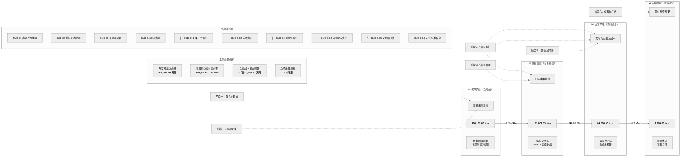

# 流程图 7：四算联动

> 四算（概算 → 预算 → 核算 → 结算）贯穿项目全生命周期。
>
> 数据基于系统看板：更新至 2026-09-09，金额单位：万元。

## 说明

| 阶段 | 金额 | 说明 | 关联业务阶段 |
|:---|:---:|:---|:---:|
| **概算** | 130,165.00 万 | 商机毛利基准，立项前编制 | 商机与售前、立项评审 |
| **预算** | 133,002.70 万 | 目标成本基线，+2.2% 偏差 | 项目执行（WBS/资源计划） |
| **核算** | 84,030.50 万 | 实时动态成本，消耗 63.2% | 项目执行、变更管理 |
| **结算** | 1,390.00 万 | 最终经营结果，成本锁定 | 结算与关闭 |

## 科目构成

| 编码 | 名称 | 层级 | 使用记录 |
|:---:|:---|:---:|:---:|
| SUB-01 | 直接人力成本 | 叶子 | 410 |
| SUB-02 | 外包开发成本 | 叶子 | 410 |
| SUB-03 | 采购与设备 | 叶子 | 410 |
| SUB-04 | 期间费用 | 父级 | 0 |
| SUB-04-1 | 第三方费用 | 叶子 | 215 |
| SUB-04-2 | 差旅费用 | 叶子 | 150 |
| SUB-04-3 | 租房费用 | 叶子 | 150 |
| SUB-04-4 | 其他期间费用 | 叶子 | 150 |
| SUB-04-5 | 交付培训费 | 叶子 | 0 |
| SUB-05 | 不可预见准备金 | 叶子 | 85 |