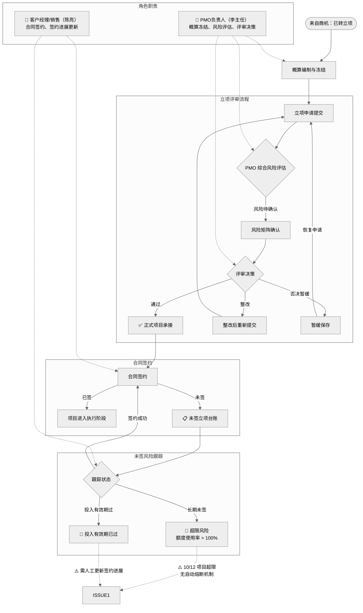

# 流程图 2：立项评审与概算冻结

> 涉及角色：PMO负责人（李主任）、客户经理/销售（陈亮）

```mermaid
%%{init: {'theme': 'neutral', 'themeVariables': {'fontSize': '14px'}}}%%

graph TB
  %% 入口
  FROM_OPP(["来自商机：已转立项"]) --> B1[概算编制与冻结]
  B1 --> B2[立项申请提交]

  subgraph REVIEW["立项评审流程"]
    direction TB
    B2 --> B3{PMO 综合风险评估}
    B3 -->|风险待确认| B4[风险矩阵确认]
    B4 --> B5{评审决策}

    B5 -->|通过| B6[✅ 正式项目承接]
    B5 -->|整改| B7[整改后重新提交]
    B5 -->|否决暂缓| B8[暂缓保存]

    B7 --> B2
    B8 -->|恢复申请| B2
  end

  subgraph SIGN["合同签约"]
    direction LR
    B6 --> C1[合同签约]
    C1 -->|已签| C2[项目进入执行阶段]
    C1 -->|未签| C3[📋 未签立项台账]
  end

  subgraph RISK["未签风险跟踪"]
    direction TB
    C3 --> D1{跟踪状态}
    D1 -->|签约成功| C1
    D1 -->|长期未签| D2["🔴 超限风险<br/>额度使用率 > 100%"]
    D1 -->|投入有效期过| D3["🔴 投入有效期已过"]
  end

  subgraph ROLES["角色职责"]
    R1["👤 PMO负责人（李主任）<br/>概算冻结、风险评估、评审决策"]
    R2["👤 客户经理/销售（陈亮）<br/>合同签约、签约进展更新"]
  end

  R1 -.-> B1
  R1 -.-> B3
  R1 -.-> B5
  R2 -.-> C1
  R2 -.-> D1

  %% 问题标注
  D2 -.->|"⚠️ 10/12 项目超限<br/>无自动熔断机制"| ISSUE1
  D3 -.->|"⚠️ 需人工更新签约进展"| ISSUE1
```

## 说明

- **概算冻结：** 完成方案编制、专家评审及 PMO 冻结概算后方可正式发起立项
- **评审决策：** 六节点分别签署（含 PMC 路径），高风险不能绕过 PMC
- **未签跟踪：** 12 个未签项目中 10 个超限、10 个到期，缺乏自动熔断