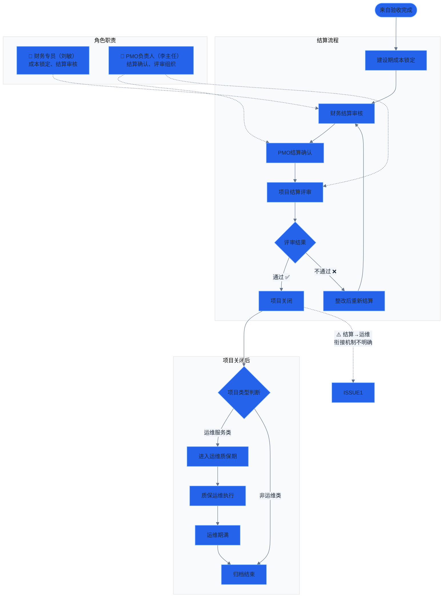

# 流程图 6：结算与关闭

> 涉及角色：财务专员（刘敏）、PMO负责人（李主任）

## 说明

- **结算流程：** 建设期成本锁定 → 财务结算审核 → PMO 结算确认 → 项目结算评审
- **项目关闭后：** 运维类项目进入质保期；非运维类项目归档
- **已结算示例：** P-008 某县数据中台建设项目（预算 1,450万，已结算 1,390万，结余 +60万）
- **问题：** 结算→运维的切换机制不明确，运维阶段的启动条件未清晰定义