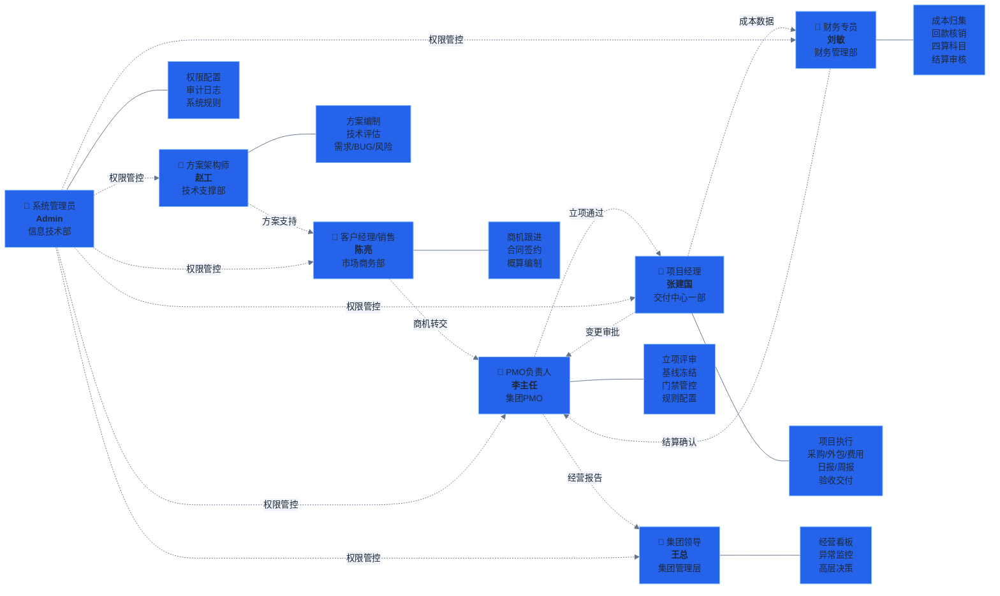

# 流程图 0：角色职责总览

> 项目管理平台 7 个角色的职责分工一览。

## 角色权限速查

| 角色 | 页面数 | 数据范围 | 敏感字段可见 |
|:---|:---:|:---|:---|
| 集团领导 | 全部 | 全集团 | 全部可见 |
| PMO负责人 | 全部+系统配置 | 全集团 | 全部可见 |
| 项目经理 | 项目相关 | 本人参与项目 | 不可见毛利/绩效 |
| 客户经理/销售 | 商机/项目/台账 | 本人参与 | 不可见成本单价 |
| 财务专员 | 全部+财务配置 | 全集团 | 不可见联系方式 |
| 方案架构师 | 技术相关 | 本人参与 | 不可见毛利/绩效 |
| 系统管理员 | 全部+全部配置 | 全集团 | 全部可见 |