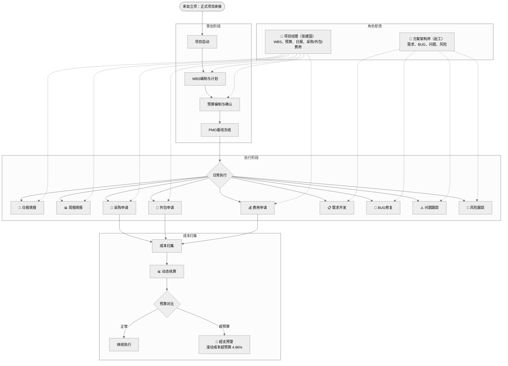

# 流程图 3：项目执行

> 涉及角色：项目经理（张建国）、方案架构师（赵工）

## 说明

- **策划阶段：** WBS 编制 → 预算编制 → PMO 基线冻结（首次预算须计划评审通过）
- **执行活动：** 采购/外包/费用申请走审批流程；日报/周报由主 PM 填报
- **成本监控：** 动态核算实时对比预算，超预算触发预警（如 P-001 超预算 4.86%）
- **需求/BUG 生命周期：** 责任人处理 → 待验证 → 发起人验证关闭