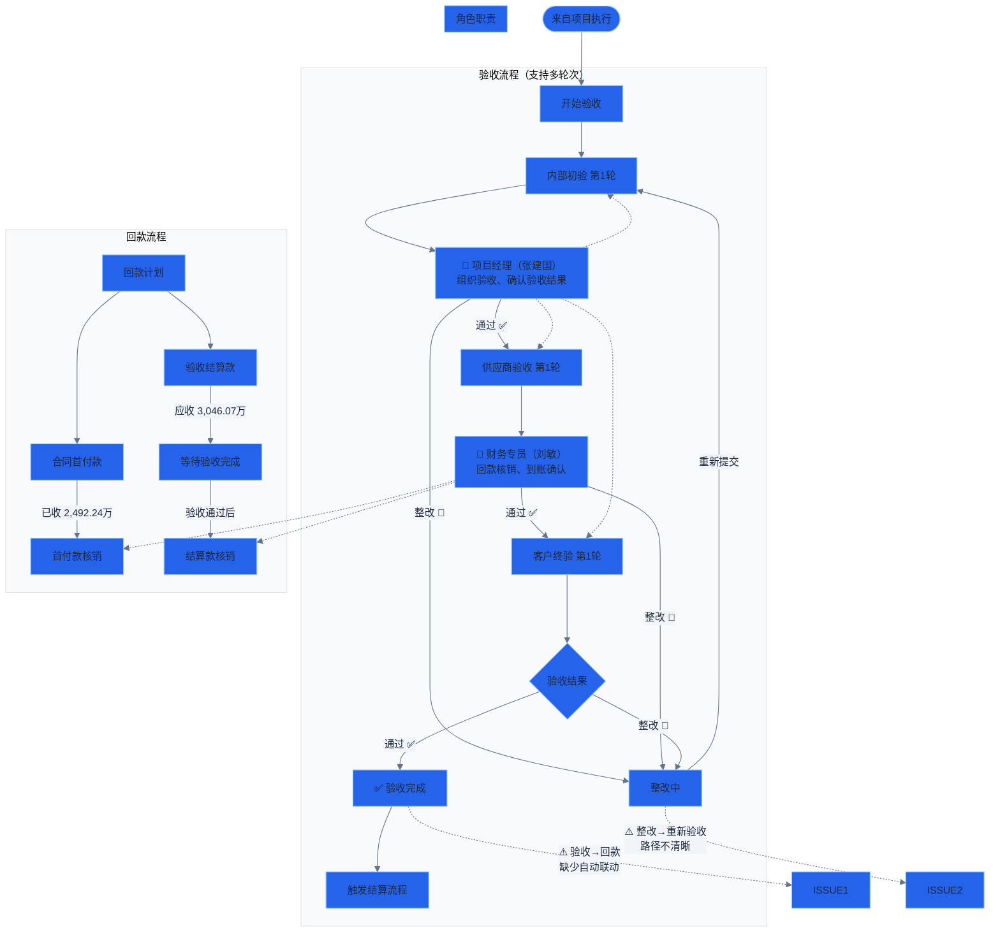

# 流程图 5：验收与回款

> 涉及角色：项目经理（张建国）、财务专员（刘敏）

## 说明

- **验收三阶段：** 内部初验 → 供应商验收 → 客户终验（每阶段支持多轮次）
- **整改闭环：** 任一阶段不通过进入整改，整改完成后重新提交该阶段验收
- **回款计划：** 合同首付款（已收 2,492.24万）+ 验收结算款（应收 3,046.07万）
- **问题：** 验收通过后未自动触发回款计划更新；整改→重新验收的 UI 路径不直观