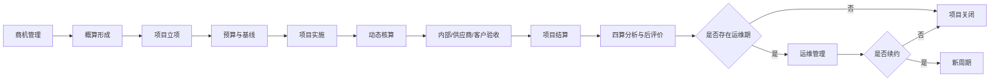
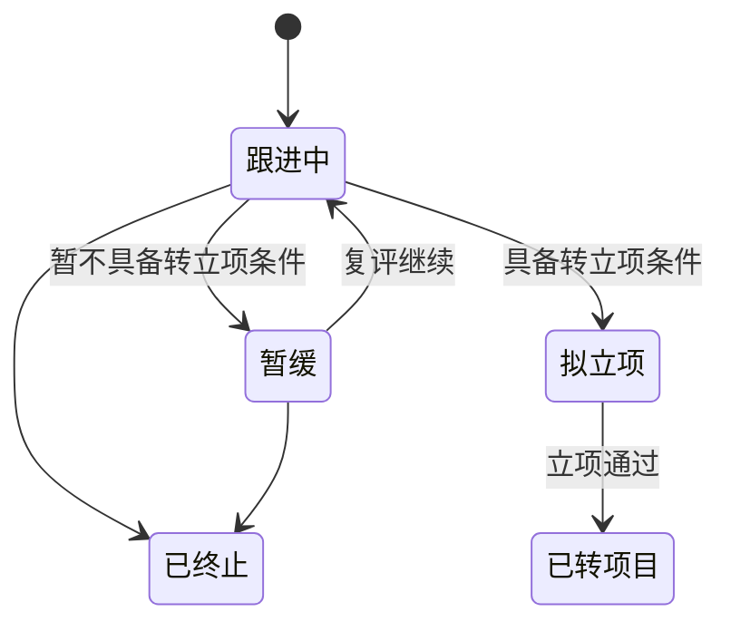
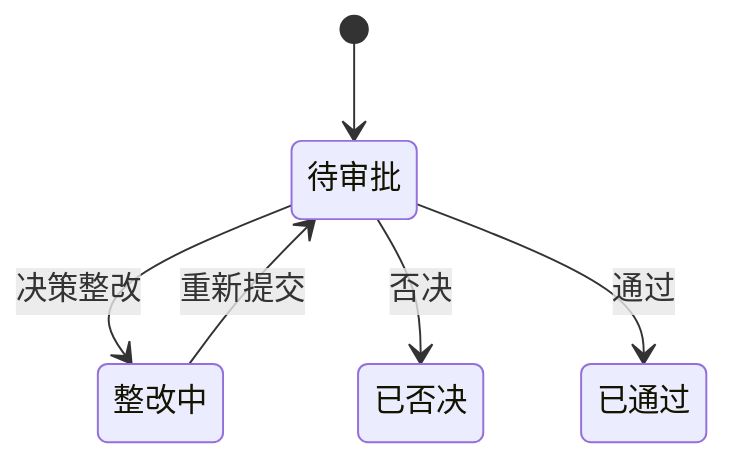
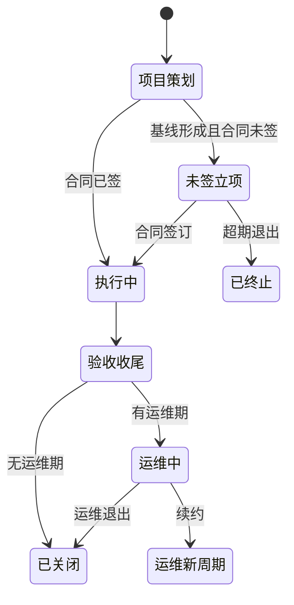
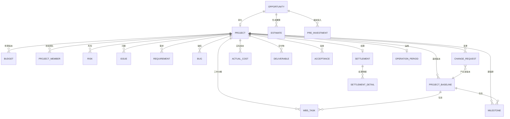
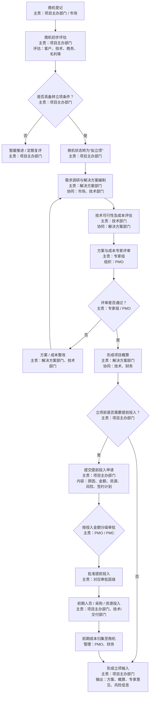
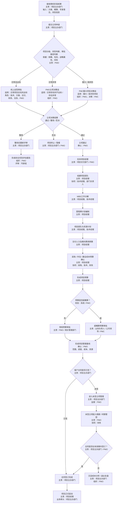
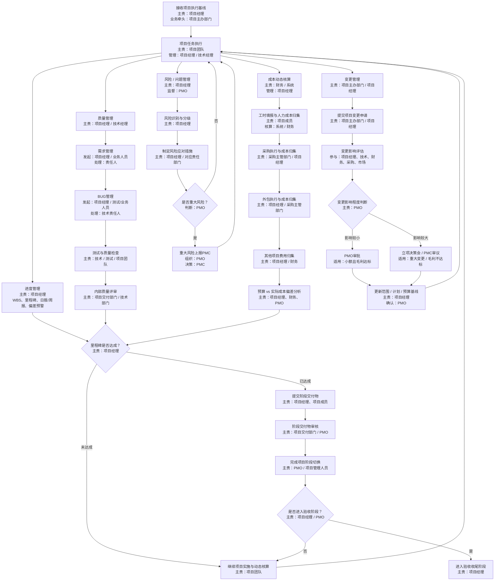
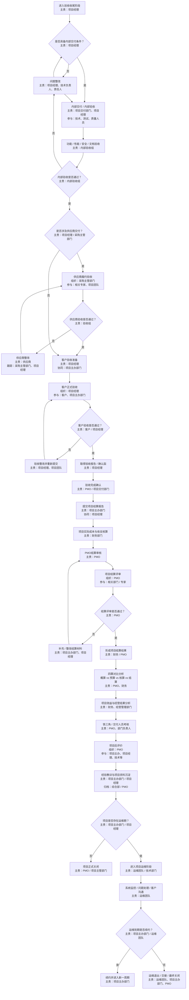

# 项目管理平台 PRD

> **文档主题：** 基于“概算—预算—核算—结算”四算体系的项目全生命周期管理平台  
> **文档版本：** V1.1  
> **文档状态：** 需求设计稿  
> **编制日期：** 2026-09-09  
> **编制依据：** 《基于项目四算的项目全生命周期管理流程》  
> **适用范围：** 面向集团型/多组织 ToB 项目制企业的项目管理场景

---

## 1. 文档说明

### 1.1 编写目的

本 PRD 基于项目“四算”全生命周期流程，将流程层面的角色、节点、判断条件和产出物进一步产品化，形成可用于产品评审、原型设计、研发设计、测试验收的详细需求说明。

本产品不是单纯的“项目台账”或“审批系统”，而是以项目经营和交付为主线，将商机、立项、计划、预算、执行、成本、风险、变更、验收、结算、后评价与运维衔接在同一项目主数据下，形成贯穿全生命周期的管理闭环。

### 1.2 本文范围

本文覆盖以下四个业务阶段：

1. **概算阶段：商机管理 / 售前阶段**
2. **预算阶段：正式立项 / 项目策划 / 未签立项管理**
3. **核算阶段：项目实施 / 动态管控阶段**
4. **结算阶段：验收 / 收尾 / 后评价 / 运维衔接**

同时包含支撑四阶段落地所需的：

- 统一项目主数据；
- 状态与阶段管理；
- 组织、角色与数据权限；
- 审批与决策机制；
- 基线与版本管理；
- 预警提醒；
- 文档与交付物管理；
- 审计留痕；
- 经营分析与四算对比。

### 1.3 产品化原则

流程图中对“金额分级”“毛利达标”“重大/高风险”“未签投入限额”“有效期”等仅给出了管理原则，没有给出固定阈值。因此本 PRD 不虚构具体数值，统一按以下方式处理：

- 需要金额、毛利、时限、风险级别判断的规则，均设计为**后台可配置规则**；
- 涉及组织差异的审批路线，设计为**规则驱动的动态审批**；
- 涉及历史数据变化的概算、预算、计划、范围等，必须保留**版本与变更记录**；
- 涉及项目关键决策、成本和验收的操作，必须形成**审计日志**，不可物理删除。

---

# 2. 产品背景与问题定义

## 2.1 业务背景

项目型企业在从售前到交付再到结算的过程中，通常存在以下问题：

- 商机阶段的方案和成本测算与项目立项、预算之间脱节；
- 立项后项目经理重新编计划、重新填预算，前后口径不一致；
- 项目执行过程中，进度、质量、问题、风险、采购、外包和费用分散管理；
- “预算”只在立项时编一次，无法反映执行过程中的实际成本变化；
- 变更发生后只修改业务事实，没有同步更新范围、计划和预算基线；
- 项目验收之后缺少系统化的结算、四算对比和后评价；
- 已立项但合同长期未签的项目容易持续投入，形成沉没成本；
- 管理层只能看到结果，难以及时发现项目经营和交付风险。

## 2.2 核心问题

本产品重点解决四类问题：

### 2.2.1 业务链路不连续

商机、立项、实施、验收、结算之间缺少统一项目主线，前一阶段的成果无法直接成为后一阶段输入。

### 2.2.2 管理基线不统一

项目范围、进度、成本、资源往往分别维护，缺少统一的项目管理基线以及变更后的版本控制。

### 2.2.3 过程成本不可见

项目执行过程中实际成本持续发生，但预算与实际数据不能及时对比，导致成本问题往往在结算时才被发现。

### 2.2.4 风险发现和升级滞后

项目风险、问题、里程碑延误、预算偏差、未签投入等缺少统一识别、责任到人、升级和闭环机制。

---

# 3. 产品定位与目标

## 3.1 产品定位

建设一个以“项目四算”为经营主线、以“项目阶段”为过程主线、以“项目基线”为控制主线的企业级项目全生命周期管理平台。

平台同时服务两类核心用户：

- **执行层：** 项目主办部门、项目经理、技术经理、项目成员、解决方案、采购、财务等；
- **管理层：** PMO、PMC、部门负责人、业务负责人、经营管理人员等。

## 3.2 产品核心目标

### 目标一：四算贯通

形成：

> 商机概算 → 项目预算 → 执行核算 → 项目结算

四套数据既独立留痕，又可纵向比较。

### 目标二：阶段受控

项目每次阶段切换都必须满足相应的业务条件和交付条件，做到“阶段有门、过门有据”。

### 目标三：预算约束执行

采购、外包、人力、费用等实际投入与预算发生关联，使项目经理能够持续看到预算、实际、预测和偏差。

### 目标四：重大事项可升级

重大风险、重大变更、成本超支、未签长期投入等事项能够按照规则自动进入 PMO / PMC 的管理范围。

### 目标五：项目数据可复盘

项目关闭后能够回答：

- 当初为什么做；
- 当初估多少钱；
- 最终批了多少钱；
- 过程中实际花了多少钱；
- 为什么发生偏差；
- 最终项目赚了还是亏了；
- 哪些经验可被后续项目复用。

---

# 4. 核心业务概念

## 4.1 四算定义

| 四算 | 业务阶段 | 核心含义 | 主要责任角色 | 主要输出 |
|---|---|---|---|---|
| 概算 | 商机 / 售前 | 在正式立项前，对方案、建设成本、资源投入和项目收益进行初步测算 | 项目主办部门、解决方案、技术、财务 | 项目概算、方案、专家意见、风险信息 |
| 预算 | 立项 / 策划 | 项目获准实施后，基于计划、WBS、资源和交付方式形成执行预算 | 项目经理、技术经理、PMO、财务 | 项目预算、WBS、里程碑、资源计划、项目基线 |
| 核算 | 实施 / 动态管控 | 依据预算和计划基线持续归集实际成本，并分析偏差与预测 | 项目经理、财务、PMO | 实际成本、滚动预测、偏差分析、变更后基线 |
| 结算 | 验收 / 收尾 | 项目验收后锁定项目实际收支并形成最终经营结果 | 财务、PMO、项目主办、项目经理 | 结算结果、四算对比、效益分析、后评价 |

## 4.2 基线定义

项目至少存在以下四类基线：

- **范围基线：** 项目交付范围、主要建设内容、关键交付物；
- **进度基线：** WBS、里程碑、计划开始/结束时间；
- **成本基线：** 经审批生效的项目预算；
- **资源基线：** 项目团队、关键岗位、计划投入。

基线一旦生效，不允许直接覆盖修改。所有调整必须通过变更流程产生新版本。

## 4.3 “阶段”与“状态”区分

- **阶段**反映项目生命周期所处位置，如概算、预算、核算、验收收尾、运维；
- **状态**反映当前业务处理结果，如拟立项、审批中、整改中、暂缓、执行中、待验收、已关闭等。

系统应同时维护“业务阶段”和“业务状态”，避免将两者混为一个字段。

---

# 5. 用户角色与职责

| 角色 | 核心职责 | 主要系统权限 |
|---|---|---|
| 项目主办部门 / 市场 | 商机发起、商机评估、立项发起、合同推进、变更协同、结算发起 | 新增/维护本人或本部门商机，发起立项、提前投入、变更、结算 |
| 解决方案部门 | 需求调研、方案编制、概算形成 | 维护方案、概算相关数据，整改评审意见 |
| 技术部门 / 技术经理 | 技术可行性、技术成本、技术方案、质量保障 | 技术评估、WBS协同、质量检查、技术变更评估 |
| 专家组 | 方案、成本、风险专业评审 | 查看评审材料、填写意见、给出通过/整改建议 |
| PMO | 项目分级、流程组织、基线确认、过程监督、风险/变更/结算管理 | 全局项目查看、规则执行、审批、阶段切换、预警监督 |
| PMC | 重大项目、重大风险、重大变更等决策 | 查看重大事项材料、给出决策意见 |
| 项目交付部门 | 项目经理任命、交付管理、内部质量管理 | 项目经理指派、项目团队管理、质量评审 |
| 项目经理 | 项目执行第一管理责任人，负责计划、资源、预算、进度、成本、问题、风险、变更、验收 | 项目全景查看、计划维护、预算编制、日报/周报、风险/问题、变更、验收 |
| 项目成员 | 执行任务、填报工时、提交交付物 | 查看参与项目、任务更新、工时填报、交付物上传 |
| 财务 | 成本口径、实际成本、收支核算、结算 | 财务数据审核、成本归集、结算、经营结果确认 |
| 采购主管部门 | 采购、供应商履约、供应商验收 | 采购执行、采购成本归集、供应商验收 |
| 法务 | 立项会签、合同/异常风险评审 | 指定节点会签与法律意见 |
| 经营管理部门 | 项目效益与经营结果分析 | 经营数据查看、效益分析 |
| 综合部 / 档案管理 | 项目资料归档 | 归档确认、资料查询 |
| 运维团队 | 验收后的运维接管、监控、问题处理和客户沟通 | 运维项目查看、运维事项维护、续约/退出协同 |
| 客户 | 外部验收主体 | 原则上不直接使用内部管理端；如开放客户门户，则仅开放验收、确认、问题反馈等受控能力 |

> **权限原则：** 同一用户可拥有多个角色；权限由“角色权限 + 组织范围 + 项目关系 + 数据密级”共同决定。

---

# 6. 总体业务流程



## 6.1 四阶段输入输出关系

| 阶段 | 输入 | 核心处理 | 输出 / 下一阶段输入 |
|---|---|---|---|
| 概算 | 商机信息、客户需求、初步商务信息 | 商机评估、方案、技术/成本评估、专家评审、提前投入 | 方案、概算、专家意见、风险信息 |
| 预算 | 概算阶段成果 | 立项决策、项目经理任命、WBS、里程碑、资源与预算 | 项目管理基线、预算、项目团队 |
| 核算 | 项目管理基线 | 项目执行、进度/质量/成本/问题/风险/变更动态管控 | 实际成本、阶段交付物、最新基线、验收输入 |
| 结算 | 验收输入、实际成本、收支数据 | 内部验收、供应商验收、客户验收、结算评审、后评价 | 结算结果、四算对比、项目档案、运维或关闭 |

---

# 7. 产品功能架构

```mermaid
flowchart TB
    P[项目管理平台]

    P --> A[商机与概算]
    P --> B[立项与预算]
    P --> C[实施与核算]
    P --> D[验收与结算]
    P --> E[项目工作台]
    P --> F[项目经营驾驶舱]
    P --> G[规则与配置]

    A --> A1[商机台账]
    A --> A2[商机评估]
    A --> A3[方案与技术评估]
    A --> A4[专家评审]
    A --> A5[项目概算]
    A --> A6[提前投入]

    B --> B1[立项申请]
    B --> B2[项目分级与决策]
    B --> B3[项目团队]
    B --> B4[WBS/里程碑]
    B --> B5[资源计划]
    B --> B6[项目预算]
    B --> B7[项目基线]
    B --> B8[未签立项管理]

    C --> C1[进度管理]
    C --> C2[质量管理]
    C --> C3[需求/BUG]
    C --> C4[成本核算]
    C --> C5[工时管理]
    C --> C6[采购/外包成本]
    C --> C7[风险/问题]
    C --> C8[项目变更]
    C --> C9[阶段切换]

    D --> D1[内部验收]
    D --> D2[供应商验收]
    D --> D3[客户验收]
    D --> D4[项目结算]
    D --> D5[四算分析]
    D --> D6[后评价]
    D --> D7[项目归档]
    D --> D8[运维衔接]

    F --> F1[全局经营总览]
    F --> F2[项目组合分析]
    F --> F3[项目健康与异常]
    F --> F4[四算经营分析]
    F --> F5[领导待决策事项]

    G --> G1[审批规则]
    G --> G2[项目分级规则]
    G --> G3[毛利/金额阈值]
    G --> G4[预警规则]
    G --> G5[权限与组织]
    G --> G6[字典与模板]
```



---

# 8. 全局产品设计要求

## 8.1 统一项目主档

系统应以“项目主档”为全生命周期数据中枢。商机转立项后，不重新创建孤立项目，而是完成业务对象转换并继承关键数据。

### 项目主档核心信息

| 信息域 | 核心字段示例 |
|---|---|
| 基本信息 | 项目编号、项目名称、客户、项目类型、所属行业、主办部门、所属组织 |
| 商机信息 | 商机编号、商机来源、预计金额、预计签约时间、赢单概率 |
| 项目分级 | 项目级别、战略属性、风险级别、审批路径 |
| 合同信息 | 合同状态、合同编号、合同金额、签订日期、合同工期、验收约定 |
| 组织信息 | 项目经理、技术经理、项目团队、项目主办部门、交付部门 |
| 四算信息 | 概算金额、预算金额、实时核算、结算金额、毛利数据 |
| 进度信息 | 当前阶段、当前里程碑、计划验收时间、实际进度、整体完成率 |
| 风险信息 | 未关闭风险数、重大风险数、未关闭问题数、重大问题数 |
| 变更信息 | 累计变更次数、当前基线版本、累计预算变化 |
| 验收信息 | 内部验收状态、供应商验收状态、客户验收状态、验收报告 |
| 运维信息 | 是否存在运维期、运维起止时间、运维团队、续约状态 |

## 8.2 编号规则

系统至少支持：

- 商机编号；
- 项目编号；
- 概算单编号；
- 预算单编号；
- 变更单编号；
- 风险/问题编号；
- 验收单编号；
- 结算单编号。

编号规则通过后台配置，编号生成后不可手工修改。

## 8.3 审批中心

所有需要审核、会签、决策的流程统一进入审批中心。

审批中心应支持：

- 串行审批；
- 并行会签；
- 或签；
- 条件分支；
- 加签；
- 转办；
- 退回上一节点；
- 退回发起人；
- 撤回（仅允许未产生后续业务数据时）；
- 抄送；
- 决策会议纪要附件；
- 审批意见必填规则；
- 审批超时提醒。

## 8.4 基线与版本

以下对象必须支持版本管理：

- 项目概算；
- 项目预算；
- WBS；
- 里程碑计划；
- 项目范围；
- 项目资源；
- 重大变更后的项目基线。

每个版本至少记录：版本号、生效时间、生效原因、发起人、审批单、与上一版本差异。

## 8.5 文档与交付物

系统按“项目阶段 + 项目类型”管理项目文档模板和交付物清单。

每份交付物至少记录：

- 交付物名称；
- 所属阶段；
- 是否必交；
- 责任人；
- 计划提交日期；
- 实际提交日期；
- 文件版本；
- 审核状态；
- 审核意见；
- 附件。

阶段切换时，如存在必交但未通过审核的交付物，默认不允许切换阶段。

## 8.6 操作审计

以下操作必须完整留痕：

- 关键字段修改；
- 概算/预算调整；
- 计划调整；
- 角色调整；
- 审批意见；
- 风险等级调整；
- 变更评估结论；
- 阶段切换；
- 验收结果；
- 成本锁定；
- 项目关闭。

---

# 9. 概算阶段详细需求

## 9.1 阶段目标

完成商机识别、分级跟踪、需求与解决方案形成、技术可行性和成本评估，形成项目概算；如立项前需要投入人员、采购或其他资源，则进行受控的提前投入管理。

## 9.2 商机登记

### 9.2.1 业务目的

建立统一商机入口，使所有潜在项目在正式投入资源前具备可识别、可跟踪、可评估的管理对象。

### 9.2.2 使用角色

- 主责：项目主办部门 / 市场；
- 查看：解决方案、技术、PMO 等授权角色。

### 9.2.3 核心字段

| 字段 | 必填 | 说明 |
|---|---|---|
| 商机名称 | 是 | 客户可识别的项目机会名称 |
| 客户 | 是 | 关联客户主数据 |
| 项目主办部门 | 是 | 商机经营责任组织 |
| 商机负责人 | 是 | 默认当前发起人，可调整 |
| 商机来源 | 是 | 客户需求、招标信息、市场线索等，字典可配置 |
| 预计项目金额 | 是 | 作为初步评估输入 |
| 预计签约时间 | 否 | 用于跟踪商机成熟度 |
| 项目类型 | 是 | 字典配置 |
| 商机描述 | 是 | 背景、目标、主要需求 |
| 竞争情况 | 否 | 竞争对手、竞争强度等 |
| 附件 | 否 | 客户材料、需求文件、招标信息等 |

### 9.2.4 业务规则

1. 保存草稿后生成商机编号；
2. 同客户、同项目名称存在相似商机时，系统提示可能重复；
3. 商机进入“拟立项”后，不允许直接删除；
4. 已产生提前投入的商机不允许直接关闭，关闭前必须完成成本处置说明。

## 9.3 商机初步评估

### 9.3.1 评估维度

按流程要求，至少覆盖：

- 客户；
- 技术；
- 商务；
- 毛利；
- 项目可控性；
- 主要风险。

### 9.3.2 产品设计

系统提供“商机评估”页签，支持结构化评分 + 文字结论。

建议支持以下产品化维度：

| 维度 | 说明 |
|---|---|
| 客户成熟度 | 客户预算、决策链、需求明确度 |
| 商务成熟度 | 采购方式、竞争格局、签约概率 |
| 技术可行性 | 现有产品能力、技术复杂度、依赖条件 |
| 交付可行性 | 工期、资源、现场、第三方依赖 |
| 经营可行性 | 预计收入、概略成本、预期毛利 |
| 风险 | 法务、回款、资金、资源、政策等 |

### 9.3.3 转立项条件

商机评估完成后，由项目主办部门选择：

- 具备转立项条件；
- 暂缓推进；
- 终止。

若选择暂缓，必须填写：暂缓原因、下次复评日期、责任人。

系统在复评日期前自动提醒责任人。

## 9.4 商机转“拟立项”

满足转立项条件后，将商机状态改为“拟立项”。

状态变更后：

- 锁定客户、商机主责组织等关键主数据；
- 自动创建方案任务；
- 自动通知解决方案部门和技术协同人员；
- 进入方案与成本评估流程。

## 9.5 需求调研与解决方案编制

### 9.5.1 主责角色

- 主责：解决方案部门；
- 协同：市场、技术部门。

### 9.5.2 功能要求

系统支持维护：

- 客户现状；
- 建设目标；
- 需求范围；
- 总体建设内容；
- 解决方案；
- 关键技术架构；
- 外部依赖；
- 初步交付边界；
- 关键假设条件；
- 方案附件及版本。

### 9.5.3 版本规则

方案提交专家评审后形成评审版本。评审退回整改时，不覆盖原版本，而是形成新版本并保留差异。

## 9.6 技术可行性及成本评估

### 9.6.1 主责角色

- 主责：技术部门；
- 协同：解决方案部门。

### 9.6.2 评估内容

- 技术路线是否可行；
- 现有产品可复用程度；
- 是否需要定制开发；
- 是否需要外购软硬件；
- 是否需要外包；
- 资源是否可满足；
- 关键技术风险；
- 初步建设成本；
- 初步交付人力；
- 其他必要投入。

### 9.6.3 成本分类

系统成本科目不在本 PRD 固化具体企业财务科目，但至少支持：

- 人力成本；
- 采购成本；
- 外包成本；
- 第三方费用；
- 期间费用；
- 其他项目成本。

成本科目由后台统一配置并在概算、预算、核算、结算阶段保持映射关系。

## 9.7 方案与成本专家评审

### 9.7.1 发起条件

需求方案、技术评估、成本评估均完成后，可由 PMO 组织专家评审。

### 9.7.2 评审材料

评审页面统一展示：

- 商机基本信息；
- 客户需求；
- 解决方案；
- 技术评估；
- 成本测算；
- 预计毛利；
- 主要风险；
- 附件。

### 9.7.3 评审结论

专家组可选择：

- 通过；
- 整改后复审。

若选择整改，必须逐条填写整改意见，并可指定责任部门和要求完成时间。

整改完成后重新进入评审，不允许绕过评审直接形成正式概算。

## 9.8 项目概算

### 9.8.1 形成条件

专家评审通过后，系统允许形成项目概算。

### 9.8.2 概算内容

至少包含：

- 预计项目收入；
- 分成本科目概算；
- 总成本；
- 预计毛利额；
- 预计毛利率；
- 风险准备说明；
- 关键测算假设；
- 概算版本。

### 9.8.3 概算冻结

概算作为立项输入后冻结当前版本。后续若售前发生变化，可形成新概算版本，但立项审批必须明确引用哪一个版本。

## 9.9 立项前提前投入

### 9.9.1 适用场景

项目正式立项前，因客户要求、交付窗口、技术验证、采购周期等原因，需要先投入人员、采购或其他资源。

### 9.9.2 申请信息

按照流程要求，至少包含：

- 提前投入原因；
- 申请金额；
- 投入资源类型；
- 投入人员/部门；
- 计划投入周期；
- 主要风险；
- 签约计划；
- 退出方案；
- 关联概算版本。

### 9.9.3 分级审批

系统根据“申请金额 + 商机级别 + 风险级别 + 组织规则”等条件自动判断审批路径。

具体金额阈值由后台配置，不在前台写死。

### 9.9.4 投入控制

审批通过后生成“可用提前投入额度”。

所有前期人员、采购、资源投入必须关联商机编号，并实时扣减可用额度。

当出现以下情形时，系统阻断新增投入或触发升级审批：

- 累计投入达到审批额度；
- 超过批准投入周期；
- 商机状态变为暂缓/终止；
- 签约计划已逾期；
- 其他后台配置的风险条件。

## 9.10 前期成本归集

前期投入成本必须先归集到商机。

商机正式转项目后：

- 商机前期成本继承到项目；
- 标记为“立项前已发生成本”；
- 纳入后续预算/核算/结算分析；
- 不允许重复计入。

## 9.11 概算阶段输出

阶段完成后形成统一“立项输入包”：

- 解决方案；
- 项目概算；
- 专家评审意见；
- 主要风险；
- 提前投入及已发生成本（如有）；
- 其他立项必要材料。

---

# 10. 预算阶段详细需求

## 10.1 阶段目标

完成项目立项风险评估和分级决策，明确项目经理及团队，形成 WBS、里程碑、资源计划与项目预算，并固化范围、进度、成本、资源四类管理基线；同时对“已立项未签合同”状态进行专项管控。

## 10.2 接收商机阶段成果

立项申请必须引用一个有效的商机及对应概算版本。

系统自动带入：

- 商机信息；
- 方案；
- 概算；
- 专家意见；
- 风险信息；
- 已发生成本；
- 关键附件。

发起人不得手工重新录入与上游完全相同的数据。

## 10.3 提交立项申请

### 10.3.1 发起角色

项目主办部门。

### 10.3.2 核心信息

- 立项名称；
- 关联商机；
- 申请组织；
- 项目类型；
- 项目预计金额；
- 是否已签合同；
- 项目必要性；
- 建设范围；
- 计划工期；
- 客户关键诉求；
- 概算版本；
- 主要风险；
- 立项建议。

## 10.4 项目分级、风险判断与审批路径

### 10.4.1 判断依据

流程明确的判断维度包括：

- 项目规模；
- 毛利；
- 战略属性；
- 风险。

### 10.4.2 产品设计

后台建设“项目分级与立项决策规则”。

规则支持配置：

- 金额区间；
- 毛利率区间；
- 项目类型；
- 战略项目标识；
- 风险级别；
- 客户等级；
- 特殊业务标签；
- 对应审批路径。

### 10.4.3 审批路径

系统至少支持三类路径：

#### 路径 A：线上会签审批

适用：日常项目且毛利达标。

会签角色：技术、方案、交付、财务、法务、PMO。

#### 路径 B：PMO 立项决策会

适用：日常项目但毛利不达标或存在异常。

系统应记录：会议时间、参会人、会议材料、决策意见、会议纪要。

#### 路径 C：PMC 重大项目决策会

适用：重大 / 高风险项目。

系统应形成重大项目决策记录并归入项目档案。

## 10.5 立项决策结果

立项决策结果统一为：

- 通过；
- 整改；
- 否决。

### 整改

必须记录整改项、责任人、截止时间。整改完成后重新进入评审，不直接恢复到“通过”。

### 否决

项目进入“终止/暂缓”。

若此前已有提前投入，系统自动生成“沉没成本处置待办”。

### 通过

由 PMO 确认立项通过并生成正式项目编号。

## 10.6 任命项目经理

### 10.6.1 主责

项目交付部门 / PMO。

### 10.6.2 规则

- 一个项目必须存在唯一主项目经理；
- 支持设置副项目经理；
- 项目经理变更必须留痕；
- 项目经理离职/调岗时，系统提示未交接项目；
- 项目经理确认接受项目后，方可进入项目策划。

## 10.7 组建项目团队

项目经理维护项目团队，包括：

- 技术经理；
- 交付成员；
- 业务协同；
- 解决方案人员；
- 财务协同；
- 采购协同；
- 其他关键角色。

每名成员需记录：角色、所属组织、计划参与时间、计划投入比例/工时、是否关键岗位。

## 10.8 WBS 工作分解

### 10.8.1 业务目的

将项目范围分解为可计划、可执行、可跟踪、可核算的工作包。

### 10.8.2 功能要求

支持：

- 多级 WBS；
- 父子任务；
- 前后置依赖；
- 责任人；
- 计划开始/结束；
- 计划工时；
- 交付物关联；
- 里程碑标识；
- Excel 导入/导出；
- 甘特图展示。

### 10.8.3 规则

- WBS 根节点必须为项目；
- 关键工作包必须指定责任人；
- 里程碑不能作为普通任务随意删除；
- WBS 评审通过后形成进度基线；
- 后续调整必须走项目变更或计划变更流程。

## 10.9 里程碑计划

里程碑至少支持：

- 名称；
- 计划日期；
- 实际日期；
- 达成条件；
- 责任人；
- 关联交付物；
- 状态；
- 是否关键里程碑。

状态建议：未开始、进行中、临近到期、已逾期、已完成。

具体“临近到期”天数由预警规则配置。

## 10.10 项目团队与资源计划

项目经理与技术经理共同维护：

- 人员资源；
- 关键岗位；
- 预计投入周期；
- 预计投入工时；
- 设备/环境资源；
- 外部资源；
- 采购资源；
- 外包资源。

资源计划与预算中的人力成本、采购/外包成本关联。

## 10.11 交付人力及期间费用预算

### 10.11.1 人力预算

项目经理按照 WBS / 阶段 / 人员进行人力预算分解。

建议支持三种粒度：

- 按阶段；
- 按 WBS；
- 按人员。

系统基于工时和人力成本规则计算预计人力成本。

### 10.11.2 期间费用

包括但不限于差旅、驻场、租赁、招待、会议等项目期间费用。具体科目由财务配置。

## 10.12 采购 / 外包 / 建设成本预算确认

项目经理对概算阶段的建设成本进一步确认，并与采购、技术、财务协同。

每一项预算至少包含：

- 成本类型；
- 预算事项；
- 供应方式；
- 预算金额；
- 计划发生阶段；
- 预计采购/外包时间；
- 责任部门；
- 备注及附件。

## 10.13 形成项目预算

项目预算由以下部分汇总：

- 建设成本；
- 采购成本；
- 外包成本；
- 项目人力成本；
- 期间费用；
- 其他配置科目。

系统实时计算：

- 预算总成本；
- 预计收入；
- 预算毛利额；
- 预算毛利率；
- 与概算差异额；
- 与概算差异率。

## 10.14 预算是否超概算

### 10.14.1 自动校验

提交预算审批时，系统按成本总额及配置的关键科目规则与当前有效概算版本进行比较。

### 10.14.2 审批分支

- 不超概算：进入常规预算审批；
- 超概算：进入超概算审批，由业务负责人 / 公司领导 / PMC 等按规则审批。

超概算必须填写：

- 超概算金额；
- 超概算比例；
- 超概算原因；
- 是否影响项目毛利；
- 应对措施；
- 责任说明。

## 10.15 形成项目管理基线

预算审批通过后，由 PMO 确认形成项目管理基线。

基线内容：

- 范围；
- WBS；
- 里程碑；
- 成本预算；
- 项目团队；
- 资源计划。

系统生成基线版本号，例如 V1.0。

项目执行阶段默认读取当前生效基线。

## 10.16 合同状态判断

形成基线后，系统判断客户合同是否已签。

### 已签

合同信息确认完成后，进入正式启动。

### 未签

进入“未签立项管理”。

## 10.17 未签立项管理

### 10.17.1 业务目的

防止项目已获立项但客户合同长期未签，项目持续投入造成不可控沉没成本。

### 10.17.2 管控维度

- 未签持续时间；
- 累计已投入成本；
- 可投入限额；
- 当前签约计划；
- 最近跟进情况；
- 风险等级。

### 10.17.3 管控规则

后台配置：

- 未签项目最大投入比例/额度；
- 未签项目有效期；
- 不同项目级别的差异化规则；
- 临近有效期提醒；
- 超限后的审批路径。

达到阈值后，系统可执行：

- 预警；
- 限制新增成本；
- 要求补充投入申请；
- 升级 PMO / PMC；
- 触发退出复盘。

## 10.18 合同未在有效期内签订

项目主办部门需发起“沉没成本分析 / 退出复盘”。

内容至少包括：

- 未签原因；
- 已投入资源；
- 已发生成本；
- 可回收资产；
- 沉没成本；
- 责任分析；
- 后续建议；
- 是否彻底终止；
- 是否保留再次激活可能。

## 10.19 项目正式启动

合同签订完成后，项目状态进入“正式启动/执行中”。

系统自动：

- 通知项目经理及团队；
- 开放工时填报；
- 开放项目采购/外包/费用关联；
- 启动里程碑预警；
- 进入核算阶段。

---

# 11. 核算阶段详细需求

## 11.1 阶段目标

以预算和计划基线为依据，围绕进度、质量、成本、变更、风险五条主线持续管控项目执行，并形成滚动核算结果。

## 11.2 项目执行工作台

项目经理进入项目后，首页应集中展示：

### 项目概览

- 项目基本信息；
- 当前阶段；
- 当前基线版本；
- 合同状态；
- 项目团队；
- 计划验收时间。

### 进度

- 当前里程碑；
- 里程碑是否逾期；
- WBS 完成率；
- 关键任务数量；
- 逾期任务数量。

### 成本

- 概算总成本；
- 预算总成本；
- 已发生成本；
- 已承诺未发生成本；
- 预测总成本；
- 剩余预算；
- 成本偏差率；
- 预测毛利。

### 风险与问题

- 未关闭问题；
- 重大问题；
- 未关闭风险；
- 重大风险；
- 超期事项。

### 快捷操作

- 更新进度；
- 提交日报/周报；
- 新增风险；
- 新增问题；
- 提需求；
- 提 BUG；
- 发起变更；
- 提交交付物；
- 发起阶段切换。

## 11.3 进度管理

### 11.3.1 WBS 执行

项目成员更新本人任务状态，项目经理拥有项目整体维护权限。

任务至少支持：

- 未开始；
- 进行中；
- 已完成；
- 暂停；
- 已取消（需原因）。

### 11.3.2 进度更新

可通过以下方式更新：

- 任务完成率；
- 实际开始时间；
- 实际完成时间；
- 剩余工作量；
- 最新进展；
- 下一步计划。

### 11.3.3 日报 / 周报

系统支持根据项目状态自动生成日报/周报待办。

日报/周报至少包含：

- 项目整体完成率；
- 最新进展；
- 本期完成事项；
- 下一期计划；
- 里程碑情况；
- 问题；
- 风险；
- 需要协调事项。

### 11.3.4 计划偏差

系统自动计算：

- 计划完成时间 vs 实际/预测完成时间；
- 里程碑延误天数；
- WBS 逾期率。

达到阈值后触发预警。

## 11.4 质量管理

### 11.4.1 业务范围

包括：

- 需求管理；
- BUG 管理；
- 测试与质量检查；
- 内部质量评审。

## 11.5 需求管理

### 使用角色

- 发起：项目经理 / 业务人员；
- 处理：责任人。

### 核心字段

- 所属项目；
- 需求标题；
- 需求类型；
- 需求描述；
- 业务价值；
- 优先级；
- 提出人；
- 责任人；
- 期望完成时间；
- 关联 WBS；
- 是否涉及范围变化；
- 是否涉及预算变化；
- 附件。

### 业务规则

若需求被判断为影响范围、成本或关键计划，则必须转入项目变更流程，不能仅在需求模块内直接实施后关闭。

## 11.6 BUG 管理

### 使用角色

- 发起：项目经理 / 测试 / 业务人员；
- 处理：技术责任人。

### 核心字段

- 所属项目；
- BUG 标题；
- 严重程度；
- 优先级；
- 复现步骤；
- 预期结果；
- 实际结果；
- 环境信息；
- 责任人；
- 修复版本；
- 计划修复时间；
- 实际修复时间；
- 验证人；
- 附件。

### 闭环流程

> 提交 → 责任人处理 → 修复 → 验证 → 关闭 / 退回

## 11.7 测试与质量检查

系统支持维护：

- 测试计划；
- 测试结果；
- 质量检查清单；
- 遗留问题；
- 缺陷统计；
- 质量结论；
- 测试报告附件。

## 11.8 内部质量评审

项目交付部门 / 技术部门可在关键里程碑前发起内部质量评审。

评审结果：

- 通过；
- 有条件通过；
- 整改后复审。

未满足强制质量条件时，不允许提交对应阶段交付物审核。

## 11.9 成本动态核算

### 11.9.1 核算目标

持续回答：

> 预算多少？已经花多少？已经承诺但还没花多少？按现在趋势最终会花多少？是否会超预算？最终毛利可能是多少？

### 11.9.2 成本口径

至少支持：

- 已发生成本；
- 已承诺成本；
- 待发生成本；
- 预测总成本；
- 剩余预算。

### 11.9.3 建议计算逻辑

- **实际成本：** 已真实发生并符合核算口径的成本；
- **承诺成本：** 已审批或已签约、后续确定会发生的成本；
- **预测总成本：** 实际成本 + 承诺成本 + 剩余工作预测成本；
- **预算偏差：** 预测总成本 - 当前生效预算；
- **预算执行率：** 实际成本 / 当前生效预算；
- **预测毛利：** 预计项目收入 - 预测总成本。

具体财务取数口径由财务规则配置。

## 11.10 工时填报与人力成本归集

### 11.10.1 工时填报

项目成员按任务或项目填报工时。

字段包括：

- 日期；
- 项目；
- WBS 任务；
- 工作内容；
- 工时；
- 是否出差；
- 备注。

### 11.10.2 校验规则

- 仅项目有效团队成员可填报；
- 项目关闭后不可新增实施工时；
- 工时不得超过组织配置的单日上限；
- 同一用户同一天累计工时需校验；
- 受预算额度控制时，达到限制条件后提示项目经理处理。

### 11.10.3 人力成本

系统根据人员成本规则自动计算人力成本，并归集到项目 / 阶段 / WBS。

项目成员默认只看到工时，不展示个人敏感成本单价；项目经理看到项目成本汇总，财务和授权管理人员可查看详细成本。

## 11.11 采购执行与成本归集

采购业务关联项目和预算科目。

项目视角至少展示：

- 采购申请；
- 采购预算；
- 已审批金额；
- 合同金额；
- 到货状态；
- 验收状态；
- 已发生成本；
- 剩余预算。

采购金额超当前可用预算时，系统阻断或进入超预算审批。

## 11.12 外包执行与成本归集

外包需关联：

- 项目；
- 外包工作范围；
- 关联 WBS；
- 预算科目；
- 外包供应商；
- 合同金额；
- 计划交付时间；
- 当前进度；
- 验收结果；
- 成本归集。

## 11.13 其他项目费用

费用申请必须关联项目和预算科目。

提交时展示：

- 科目预算；
- 已使用金额；
- 本次申请金额；
- 申请后剩余额度；
- 是否超预算。

## 11.14 预算 vs 实际成本偏差分析

系统按以下维度展示偏差：

- 项目整体；
- 成本科目；
- 项目阶段；
- WBS；
- 组织；
- 时间。

偏差分级阈值由后台配置。

达到预警级别后，推送项目经理、财务、PMO。

## 11.15 风险管理

### 11.15.1 风险字段

- 风险标题；
- 风险类别；
- 风险描述；
- 发生概率；
- 影响程度；
- 风险等级；
- 责任人；
- 应对措施；
- 计划完成时间；
- 当前状态；
- 是否转问题。

### 11.15.2 风险分级

系统支持配置风险矩阵。

风险等级由“发生概率 × 影响程度”或企业配置规则计算。

### 11.15.3 重大风险

PMO 判断为重大风险后：

- 自动升级 PMC；
- 生成重大风险决策待办；
- 项目首页高亮；
- 未关闭前持续跟踪。

## 11.16 问题管理

风险已经发生后可转为问题。

问题至少包含：

- 问题描述；
- 问题等级；
- 影响范围；
- 责任人；
- 解决措施；
- 计划完成时间；
- 最新进展；
- 是否超期；
- 关闭结论。

问题超期后按配置进行逐级升级。

## 11.17 项目变更管理

### 11.17.1 适用范围

包括但不限于：

- 项目范围变更；
- 需求重大变更；
- 合同变化；
- 关键里程碑变化；
- 预算变化；
- 采购/外包重大变化；
- 关键资源变化。

### 11.17.2 变更申请

主责：项目主办部门 / 项目经理。

字段至少包括：

- 变更类型；
- 变更原因；
- 原基线内容；
- 变更后内容；
- 客户依据；
- 合同依据；
- 紧急程度；
- 附件。

## 11.18 变更影响评估

参与角色：项目经理、技术、财务、采购、市场。

评估至少覆盖：

- 范围影响；
- 进度影响；
- 成本影响；
- 收入影响；
- 毛利影响；
- 人员影响；
- 采购影响；
- 外包影响；
- 风险影响；
- 合同影响。

## 11.19 变更分级与审批

PMO 根据影响程度判断：

### 影响较小

适用“小额且毛利达标”等企业配置规则，由 PMO 审批。

### 影响较大

重大变更或变更后毛利不达标，进入立项决策会 / PMC 审议。

系统不写死金额和毛利阈值，由后台统一配置。

## 11.20 更新基线

变更审批通过后，根据变更影响自动生成：

- 新范围基线；
- 新计划基线；
- 新预算基线；
- 新资源基线。

仅更新受影响部分，但必须统一生成新的“项目基线版本”。

历史基线只读保留。

## 11.21 里程碑达成与阶段切换

### 11.21.1 里程碑未达成

项目继续实施与动态核算。

若里程碑逾期：

- 标记逾期；
- 推送项目经理；
- 按规则推送 PMO；
- 要求填写原因及新预测日期；
- 若涉及基线变化，必须发起变更。

### 11.21.2 里程碑已达成

项目经理提交阶段交付物。

### 11.21.3 阶段交付物审核

项目交付部门 / PMO 审核：

- 是否齐全；
- 是否符合模板；
- 是否满足阶段达成条件；
- 是否存在未关闭的阻断问题。

审核通过后由 PMO / 项目管理人员完成项目阶段切换。

### 11.21.4 是否进入验收阶段

若下一阶段为验收，进入“验收收尾阶段”；否则继续项目执行。

---

# 12. 结算阶段详细需求

## 12.1 阶段目标

完成内部交付验收、供应商履约验收、客户正式验收、项目收支结算、四算对比、经营效益分析、人员考核、项目后评价和资料沉淀，并根据项目合同判断进入运维或正式关闭。

## 12.2 内部交付条件检查

项目经理发起内部交付检查。

系统根据项目类型和阶段配置检查项，例如：

- 核心功能完成；
- 关键 BUG 已处理；
- 测试通过；
- 性能满足；
- 安全检查完成；
- 项目文档齐全；
- 关键交付物齐全；
- 重大问题已处置；
- 其他企业配置条件。

不满足内部交付条件时，不允许进入内部验收，项目回到整改。

## 12.3 内部交付 / 内部验收

主责：项目交付部门、项目经理；参与：技术、测试、质量人员。

内部验收按清单执行，至少覆盖：

- 功能；
- 性能；
- 安全；
- 文档。

结果：

- 通过；
- 不通过。

不通过必须生成整改项，并指定责任人和完成时间。

## 12.4 供应商履约验收

### 适用条件

项目涉及供应商交付时执行。

### 主责

采购主管部门组织，相关专家和项目团队参与。

### 验收内容

- 合同约定交付内容；
- 数量；
- 质量；
- 到货/交付时间；
- 技术参数；
- 文档资料；
- 服务要求；
- 遗留问题。

### 结果

- 通过；
- 整改。

整改后重新验收。

## 12.5 客户验收准备

项目经理主责、项目主办部门协同。

系统维护验收准备清单：

- 验收方案；
- 验收材料；
- 验收范围；
- 验收时间；
- 客户参与人；
- 内部参与人；
- 未关闭事项；
- 验收风险；
- 验收会议安排。

## 12.6 客户正式验收

系统记录：

- 验收日期；
- 验收类型；
- 客户验收结论；
- 验收意见；
- 遗留事项；
- 验收金额（如适用）；
- 验收报告/确认函；
- 客户签章附件。

验收未通过时，生成整改项并重新提交验收。

## 12.7 验收完成确认

取得验收报告 / 确认函后，由 PMO / 项目交付部门完成验收确认。

确认后：

- 项目进入结算处理；
- 固化验收时间；
- 原则上关闭实施阶段新增范围；
- 如仍需发生实施成本，必须按企业规则走特殊审批；
- 触发项目结算任务。

## 12.8 提交项目结算报告

主责：项目主办部门；协同：项目经理。

结算报告至少包含：

- 项目基本信息；
- 合同收入；
- 实际验收情况；
- 回款情况；
- 概算；
- 当前有效预算；
- 实际成本；
- 未决成本；
- 变更情况；
- 主要偏差；
- 项目经营结论；
- 遗留事项。

## 12.9 实际成本与收支核算

财务部门负责确认项目最终核算口径。

系统汇总：

- 项目收入；
- 已开票；
- 已回款；
- 应收；
- 实际建设成本；
- 人力成本；
- 采购成本；
- 外包成本；
- 项目费用；
- 其他成本；
- 实际总成本；
- 实际毛利；
- 实际毛利率。

## 12.10 PMO 结算审核

PMO 审核重点：

- 是否完成验收；
- 是否存在未归集成本；
- 是否存在未关闭重大问题；
- 变更是否完整；
- 结算材料是否齐全；
- 数据是否与项目过程一致。

## 12.11 项目结算评审

PMO 组织，相关部门 / 专家参与。

结论：

- 通过；
- 补充 / 整改。

不通过则返回项目主办部门、项目经理补充材料后重新审核。

## 12.12 形成项目结算结果

结算通过后：

- 生成结算版本；
- 锁定实施期实际成本；
- 生成项目最终经营数据；
- 作为四算分析基础。

## 12.13 四算对比分析

### 12.13.1 对比维度

按：

> 概算 vs 预算 vs 核算 vs 结算

进行横向对比。

### 12.13.2 指标

至少包括：

- 项目收入；
- 总成本；
- 人力成本；
- 采购成本；
- 外包成本；
- 项目费用；
- 毛利额；
- 毛利率。

### 12.13.3 偏差分析

系统计算：

- 预算较概算变化；
- 核算较预算偏差；
- 结算较预算偏差；
- 结算较概算偏差。

对超过阈值的科目要求填写偏差原因。

### 12.13.4 偏差原因分类

后台可配置，例如：

- 售前估算偏差；
- 项目范围变化；
- 客户需求变化；
- 采购价格变化；
- 外包变化；
- 人力投入超预期；
- 工期延长；
- 质量返工；
- 管理问题；
- 不可抗力；
- 其他。

## 12.14 项目效益与经营结果分析

财务、经营管理部门分析：

- 实际收入；
- 实际回款；
- 应收情况；
- 实际成本；
- 实际毛利；
- 资金占用；
- 项目周期；
- 经营偏差。

支持按组织、行业、客户、项目类型、项目经理等维度统计。

## 12.15 铁三角 / 交付人员考核

系统提供考核数据，不在本 PRD 固化具体绩效公式。

可提供的客观数据包括：

- 项目是否按期验收；
- 预算偏差；
- 项目毛利；
- 重大问题数量；
- 客户验收结果；
- 需求/BUG处理情况；
- 项目文档完整度；
- 项目后评价结果。

## 12.16 项目后评价

PMO 组织项目主办、项目经理、技术等参与。

后评价至少包含：

- 项目目标完成情况；
- 商务目标；
- 进度目标；
- 成本目标；
- 质量目标；
- 客户目标；
- 重大风险复盘；
- 重大变更复盘；
- 成功经验；
- 失败教训；
- 后续改进建议。

## 12.17 经验教训与资料沉淀

系统支持将项目资料按分类归档：

- 商机资料；
- 方案；
- 立项材料；
- 合同；
- WBS / 计划；
- 预算；
- 变更；
- 需求 / BUG；
- 问题 / 风险；
- 测试与质量资料；
- 验收资料；
- 结算材料；
- 项目总结；
- 经验教训。

归档完成后，项目普通用户只读。

## 12.18 运维判断

### 无运维期

PMO / 项目主管部门确认项目正式关闭。

### 有运维期

项目进入运维阶段。

系统应生成运维交接任务，至少包含：

- 运维范围；
- 运维起止时间；
- 运维团队；
- 联系人；
- 系统信息；
- 遗留问题；
- 账号与权限交接；
- 运维 SLA；
- 项目资料。

## 12.19 运维管理

运维团队持续维护：

- 系统监控；
- 问题处理；
- 客户沟通；
- 服务记录；
- SLA 达成；
- 运维风险；
- 运维成本。

## 12.20 运维到期与续约

运维到期前按配置提前提醒项目主办部门和运维团队。

### 续约

续约成功后，进入新一周期。新周期必须保留与原项目/合同的关联关系。

### 不续约

执行运维退出、交接、账号回收、资料归档，最终由 PMO 确认关闭。

---

# 13. 状态模型设计

> 以下为基于业务流程形成的产品化状态建议，具体名称可在原型阶段与业务统一。

## 13.1 商机状态



## 13.2 立项状态



## 13.3 项目执行状态



---

# 14. 预警与提醒设计

## 14.1 预警中心原则

预警不是单独割裂的业务流程，而是贯穿项目全生命周期的系统能力。

所有预警至少包含：

- 预警类型；
- 业务对象；
- 项目；
- 预警级别；
- 触发规则；
- 当前责任人；
- 首次触发时间；
- 持续时间；
- 是否已处理；
- 处理说明。

## 14.2 典型预警

### 概算阶段

- 商机长期未更新；
- 复评日期到期；
- 提前投入额度不足；
- 提前投入超期；
- 签约计划逾期。

### 预算阶段

- 立项审批超时；
- 预算超概算；
- WBS 未按时完成；
- 里程碑未确认；
- 已立项未签合同；
- 未签投入达到阈值。

### 核算阶段

- 里程碑临期；
- 里程碑逾期；
- 任务逾期；
- 实际成本接近预算；
- 预测成本超预算；
- 毛利低于阈值；
- 问题超期；
- 重大风险；
- 交付物缺失。

### 结算阶段

- 验收整改超期；
- 客户验收计划超期；
- 结算未及时发起；
- 结算材料缺失；
- 运维即将到期；
- 续约未确认。

## 14.3 升级机制

预警支持按时间和级别升级：

> 责任人 → 项目经理 → 部门负责人 → PMO → PMC

具体升级层级和时长由后台配置。

---

# 15. 规则配置中心

ToB 项目管理的审批和阈值具有明显的组织差异，核心规则不得写死在代码中。

后台至少提供以下配置能力：

## 15.1 项目分级规则

- 项目金额；
- 项目类型；
- 战略属性；
- 客户级别；
- 风险级别。

## 15.2 毛利规则

- 毛利达标值；
- 毛利预警值；
- 毛利异常审批路径。

## 15.3 审批规则

- 立项审批；
- 提前投入审批；
- 超概算审批；
- 重大变更审批；
- 结算审批。

## 15.4 未签立项规则

- 有效期；
- 最大投入额度；
- 最大投入比例；
- 预警天数；
- 超限审批。

## 15.5 预警规则

- 里程碑临期天数；
- 成本预警比例；
- 问题升级时间；
- 风险升级条件；
- 结算超期规则。

## 15.6 字典与模板

- 项目类型；
- 风险类别；
- 问题类别；
- 变更类型；
- 成本科目；
- 交付物模板；
- 评审模板；
- 后评价模板。

---

# 16. 权限模型

## 16.1 权限维度

采用：

> 功能权限 + 数据权限 + 项目关系权限 + 字段权限

### 功能权限

控制是否可使用某模块或操作。

### 数据权限

支持：

- 本人；
- 本部门；
- 本部门及下级；
- 指定组织；
- 全集团。

### 项目关系权限

项目经理、项目成员、主办部门、协同部门只看到与自己有关的项目，除非拥有更高管理权限。

### 字段权限

对敏感字段进行单独控制，例如：

- 人员成本单价；
- 项目毛利；
- 经营评价；
- 绩效数据。

## 16.2 SaaS 组织模型建议

如果产品未来面向多客户输出，底层模型建议按：

> 租户 → 法人/组织 → 部门 → 用户 → 角色

设计数据隔离。

若当前仅集团内部使用，可先以单租户形态部署，但数据模型保留租户字段，避免后续产品化重构。

---

# 17. 项目经营驾驶舱（领导端）

## 17.1 产品定位

项目经营驾驶舱是面向公司领导、业务群/事业部负责人、交付负责人、PMO 管理层等决策角色的全局项目经营管理入口。

其核心目标不是替代项目经理进行日常执行，而是帮助管理层快速回答以下问题：

1. 公司当前有多少项目、对应多大的项目盘子；
2. 当前项目组合整体是否赚钱，预计最终能够实现多少毛利；
3. 哪些项目正在发生进度、成本、毛利、回款或重大风险异常；
4. 异常是由什么原因导致，影响到哪些组织、项目和责任人；
5. 当前有哪些事项需要领导协调、审批或决策。

因此，驾驶舱按照“**全局概览 → 异常识别 → 原因分析 → 项目穿透 → 管理决策**”设计，而不是单纯堆叠图表。

## 17.2 使用角色与数据范围

| 角色 | 默认数据范围 | 主要关注内容 |
|---|---|---|
| 集团领导 | 全集团 | 整体经营、重大项目、高风险项目、毛利与回款 |
| 业务群/事业部负责人 | 本业务群/事业部 | 本组织项目组合、经营结果、异常项目 |
| 交付负责人 | 本交付体系 | 在建项目、进度、成本、质量、交付风险 |
| PMO负责人 | 管辖范围内全部项目 | 项目健康、阶段规范、风险问题、未签及异常项目 |
| 部门负责人 | 本部门 | 本部门负责/参与项目、人员投入及经营情况 |
| 项目总监 | 所管辖项目 | 项目组合进度、成本、问题、验收及关键决策事项 |

同一套驾驶舱页面根据用户的数据权限自动限定统计口径，不为不同管理角色建设重复页面。

## 17.3 第一屏核心经营指标

驾驶舱第一屏应优先回答“项目规模、经营结果、风险状态”三类问题。

### 17.3.1 项目规模指标

至少展示：

- 在管项目数及金额；
- 在建项目数及金额；
- 未签立项项目数及金额；
- 验收收尾项目数及金额；
- 运维项目数及金额；
- 已关闭/已结算项目数及金额。

项目规模指标均同时展示“项目数量”和“项目金额”，避免仅以项目数量判断经营影响。

### 17.3.2 项目经营指标

至少展示：

- 合同总额；
- 概算成本；
- 当前有效预算成本；
- 已发生成本；
- 实时滚动预测成本；
- 已结算成本；
- 预算毛利；
- 当前预测毛利；
- 当前预测毛利率；
- 毛利偏差；
- 应收金额；
- 已回款金额；
- 回款完成率。

其中，管理层最重要的经营判断指标为：

> **按当前执行趋势，预计项目最终成本、预计毛利及预计毛利率是多少。**

不能只展示“已经发生了多少成本”。

## 17.4 项目健康度模型

### 17.4.1 设计目标

为了避免管理层自行阅读多个业务字段判断项目是否异常，系统应对项目形成统一的“项目健康度”判断。

健康状态建议统一为：

- **健康**
- **关注**
- **预警**
- **高风险**

### 17.4.2 健康度判断维度

项目健康度至少由以下维度共同判断：

| 健康维度 | 典型判断因素 |
|---|---|
| 进度健康 | 里程碑是否临期/逾期、实际进度与计划进度偏差 |
| 成本健康 | 预算执行率、实时滚动成本是否接近或超过预算 |
| 经营健康 | 预测毛利率、毛利下降幅度、项目经营结果 |
| 回款健康 | 应收未收、回款计划逾期、回款完成率 |
| 风险健康 | 重大风险、重大问题、问题超期时间 |
| 合规健康 | 未签立项投入超限、阶段应切未切、关键交付物缺失 |

具体阈值不在本 PRD 固定写死，通过规则配置中心维护。

### 17.4.3 健康度展示

驾驶舱应同时展示：

- 各健康状态项目数量；
- 各健康状态项目金额；
- 健康状态变化趋势；
- 从“高风险/预警”直接下钻项目清单。

系统必须展示项目被判定为某健康状态的主要原因，例如：

> 高风险：终验逾期 52 天 + 预测成本超预算 18% + 存在 1 个重大问题。

## 17.5 驾驶舱页面结构

建议页面采用以下信息层级：

```text
项目经营驾驶舱
├── 全局筛选
│   ├── 组织
│   ├── 区域
│   ├── 项目类型
│   ├── 项目等级
│   ├── 行业
│   └── 时间范围
├── 核心经营指标
│   ├── 项目规模
│   ├── 合同/预算/成本
│   ├── 毛利
│   └── 回款
├── 项目结构与健康度
│   ├── 四阶段项目分布
│   ├── 项目状态分布
│   └── 项目健康度分布
├── 经营与执行分析
│   ├── 进度
│   ├── 成本
│   ├── 毛利
│   ├── 回款
│   └── 四算偏差
├── 重点异常项目
│   ├── 高风险项目
│   ├── 进度异常
│   ├── 成本/毛利异常
│   ├── 回款异常
│   └── 未签立项异常
└── 待决策/待关注事项
    ├── 重大项目变更
    ├── 超概算/重大预算事项
    ├── 重大风险
    ├── 未签投入超限
    └── 结算异常
```

## 17.6 项目阶段与组合分析

### 17.6.1 四阶段分布

按照四算阶段展示项目组合：

- 概算阶段；
- 预算阶段；
- 核算阶段；
- 结算/运维阶段。

每个阶段至少展示项目数、项目金额，并支持按组织进一步拆分。

### 17.6.2 组织项目组合分析

支持按照以下维度进行组合分析：

- 集团；
- 业务群/事业部；
- 区域；
- 行业；
- 项目类型；
- 项目等级；
- 项目经理/项目总监；
- 客户。

例如：

> 集团 → 某业务群 → 高风险项目 8 个 → 项目列表 → 某项目详情。

## 17.7 四算经营分析

四算分析是领导驾驶舱区别于普通项目管理看板的核心能力。

### 17.7.1 四算纵向对比

针对单项目及项目组合展示：

> 概算 → 预算 → 核算 → 结算

至少支持以下差异：

- 概算 vs 预算；
- 预算 vs 已发生；
- 预算 vs 实时滚动成本；
- 核算预测 vs 最终结算。

### 17.7.2 成本偏差来源

支持按成本科目继续下钻：

- 人力；
- 采购；
- 外包；
- 第三方费用；
- 差旅；
- 租房；
- 其他统一成本科目。

示例：

```text
项目预算成本：760 万
滚动预测成本：930 万
预计超预算：170 万

偏差来源：
采购 +80 万
外包 +45 万
人力 +30 万
其他 +15 万
```

### 17.7.3 毛利变化

支持展示：

> 概算毛利 → 预算毛利 → 当前预测毛利 → 实际结算毛利

帮助管理层识别“项目从哪个阶段开始发生利润损失”。

## 17.8 异常项目中心

驾驶舱下半部分应以“异常项目清单”为主，而不是继续增加大量图表。

异常项目清单至少支持：

| 字段 | 说明 |
|---|---|
| 项目名称 | 可点击进入项目详情 |
| 项目金额 | 用于判断影响规模 |
| 所属组织 | 业务群/事业部/区域 |
| 当前阶段 | 当前生命周期阶段 |
| 健康度 | 健康/关注/预警/高风险 |
| 主要异常 | 自动汇总最重要的 1~3 个异常 |
| 预测毛利偏差 | 当前预测相对预算变化 |
| 进度偏差 | 关键里程碑或验收延期情况 |
| 项目经理/项目总监 | 当前项目责任角色 |
| 持续时间 | 异常持续时间 |

默认优先展示：

- 高风险项目 TOP；
- 预测成本超预算 TOP；
- 毛利下降 TOP；
- 进度延期 TOP；
- 回款逾期 TOP；
- 未签投入异常 TOP。

## 17.9 领导待决策事项

驾驶舱应提供独立的“待决策/待关注”区域，将管理层从“看数据”进一步引导到“采取管理动作”。

典型事项包括：

- 重大项目变更待决策；
- 超概算或重大预算事项；
- 重大风险待协调；
- 未签立项超限待处理；
- 重大验收异常；
- 重大结算异常。

每条事项至少展示：

- 事项类型；
- 项目；
- 影响金额；
- 影响说明；
- 当前责任人；
- 等待时长；
- 建议处理动作；
- 关联审批/业务单据。

点击后进入原业务审批或详情页面完成处理，驾驶舱本身不重复建设业务审批能力。

## 17.10 项目穿透链路

所有聚合指标必须支持穿透，标准链路为：

> 集团/组织 → 项目组合 → 异常项目清单 → 单项目详情 → 异常原因 → 原始业务单据/成本明细。

例如：

> 预测超预算项目 12 个  
> → 查看 12 个项目  
> → 进入 A 项目  
> → 查看采购成本超预算 80 万  
> → 查看采购合同及采购成本明细。

穿透后应保留用户在上一级页面中的筛选上下文，支持一键返回。

## 17.11 全局筛选与视图

驾驶舱至少支持：

- 组织；
- 区域；
- 项目类型；
- 项目等级；
- 行业；
- 客户；
- 项目经理；
- 时间范围；
- 项目健康度。

支持“保存常用视图”，例如：

- 集团经营总览；
- 某业务群经营视图；
- 重大项目视图；
- 高风险项目视图。

## 17.12 数据口径与刷新

驾驶舱数据必须展示“数据更新时间”。

不同数据可采用不同刷新策略：

- 项目状态、问题风险、审批状态：准实时；
- 财务成本、回款：以财务系统同步频率为准；
- 大规模经营聚合：允许按固定周期预计算。

所有经营指标必须明确口径，避免同一“成本”“毛利”“项目金额”在不同页面出现不同结果。

## 17.13 驾驶舱产品边界

驾驶舱主要负责：

- 发现问题；
- 识别重点；
- 分析原因；
- 穿透项目；
- 进入决策。

不承担：

- 项目经理日常计划维护；
- 业务数据重复录入；
- 采购、外包、费用等具体业务执行；
- 替代原审批流程。

## 17.14 驾驶舱验收标准

至少满足：

1. 不同管理角色进入驾驶舱只能看到自身数据权限范围；
2. 第一屏能够同时查看项目规模、经营结果和风险状态；
3. 所有核心 KPI 能下钻至项目清单；
4. 高风险项目能够展示明确的健康度判定原因；
5. 四算分析能够展示概算、预算、核算、结算间的差异；
6. 成本偏差能够继续下钻到成本科目；
7. 待决策事项能够直接进入对应审批或业务详情；
8. 从组织级指标可以穿透到单项目；
9. 页面明确展示数据更新时间和主要指标口径；
10. 不同用户在相同页面下根据权限获得不同数据范围。

---


# 18. 项目经理工作台

项目经理工作台聚焦“今天我需要处理什么”。

## 18.1 我的项目

区分：

- 我负责的项目；
- 我参与的项目。

列表展示：

- 项目名称；
- 项目金额；
- 当前阶段；
- 当前里程碑；
- 计划验收日期；
- 进度状态；
- 成本状态；
- 问题数；
- 风险数。

## 18.2 我的待办

集中展示：

- 审批待办；
- 任务待办；
- 里程碑待办；
- 交付物待办；
- 风险/问题待办；
- 验收待办；
- 结算待办。

## 18.3 快捷发起

根据项目当前阶段动态显示可发起操作，避免出现与当前阶段无关的入口。

---

# 19. 核心数据对象关系



---

# 20. 数据一致性规则

## 20.1 单一来源原则

同一业务事实只能存在一个权威来源：

- 客户来源于客户主数据；
- 组织和人员来源于组织人事主数据；
- 合同数据来源于合同系统或项目合同模块；
- 财务实际发生数据来源于财务系统；
- 采购实际数据来源于采购系统；
- 工时来源于工时系统或项目工时模块。

项目平台不应让用户重复维护已有权威系统的数据。

## 20.2 继承原则

- 商机转项目：继承商机、方案、概算、风险、前期成本；
- 预算形成：继承概算但形成独立预算版本；
- 变更：继承原基线并生成新版本；
- 结算：引用历史概算、预算、核算，不反写历史版本。

## 20.3 删除原则

关键业务单据原则上仅支持“作废”，不支持物理删除。

作废必须记录：作废人、作废原因、作废时间。

---

# 21. 系统集成要求

> 本节为产品落地所需的集成边界建议，具体以企业现有系统为准。

## 21.1 CRM / 商机系统

同步：客户、商机、销售负责人、预计金额、预计签约时间等。

## 21.2 合同系统

同步：合同编号、合同金额、签订时间、合同状态、工期、验收约定、运维期等。

## 21.3 财务系统

同步：实际成本、收入、开票、回款、应收、结算等财务数据。

## 21.4 采购系统

同步：采购申请、采购合同、到货、验收、采购成本。

## 21.5 外包系统

同步：外包申请、外包合同、交付、验收、外包成本。

## 21.6 HR / 组织系统

同步：组织、人员、岗位、职级、在职状态。

## 21.7 消息平台 / OA

用于：

- 待办；
- 审批；
- 预警；
- 抄送；
- 重大事项提醒。

---

# 22. 非功能需求

## 22.1 性能

- 常规列表页首次加载建议 ≤ 3 秒；
- 普通表单保存/提交建议 ≤ 2 秒（不含外部系统接口耗时）；
- 管理驾驶舱大数据查询应支持异步加载和缓存；
- 大型 WBS 支持至少千级任务量的可用操作体验。

## 22.2 可用性

- 关键业务表单支持自动保存草稿；
- 审批提交失败时不得丢失填写内容；
- 外部接口失败需明确展示失败原因并支持重试；
- 重要操作提供二次确认。

## 22.3 安全

- 统一身份认证；
- 最小权限原则；
- 敏感字段脱敏；
- 文件权限控制；
- 数据导出权限控制；
- 审计日志不可被普通管理员篡改。

## 22.4 可配置性

项目分级、毛利阈值、审批路线、预警条件、项目类型、成本科目、交付物模板等必须配置化，避免每次制度变化都需要开发发版。

## 22.5 可追溯性

项目从商机到关闭的所有关键数据均能追溯：

> 谁在什么时候基于什么数据做了什么决策，产生了什么结果。

---

# 23. 关键业务验收标准

## 23.1 概算阶段

1. 商机可登记、评估、暂缓、复评、转拟立项；
2. 方案、技术评估和成本评估可形成版本；
3. 专家评审支持通过/整改闭环；
4. 评审通过后可形成项目概算；
5. 提前投入可按规则分级审批；
6. 提前投入成本能够归集商机并在转项目后继承；
7. 能够形成完整立项输入包。

## 23.2 预算阶段

1. 立项可自动继承商机阶段成果；
2. 系统可根据项目规模、毛利、战略属性、风险判断审批路径；
3. 立项支持通过/整改/否决；
4. 可任命项目经理和组建项目团队；
5. 可形成 WBS、里程碑、资源计划；
6. 可编制项目预算并自动与概算对比；
7. 超概算可进入差异化审批；
8. 审批后形成不可直接覆盖的项目管理基线；
9. 未签合同项目可执行投入限额和时限管控；
10. 合同签订后可正式启动项目。

## 23.3 核算阶段

1. 项目执行基于当前有效基线；
2. 可跟踪 WBS、里程碑和进度偏差；
3. 可管理需求、BUG、测试与质量；
4. 工时、采购、外包、其他费用可归集到项目；
5. 可查看预算、实际、预测和偏差；
6. 风险/问题可分级、责任到人、超期升级；
7. 重大风险可升级 PMC；
8. 变更可评估范围/进度/成本等影响；
9. 重大变更可进入决策会；
10. 变更通过后自动形成新基线版本；
11. 里程碑达成后可提交交付物并进行阶段切换。

## 23.4 结算阶段

1. 内部验收不通过可整改重提；
2. 涉及供应商时可完成供应商履约验收闭环；
3. 客户验收不通过可整改重提；
4. 客户验收通过后可取得验收报告并确认验收完成；
5. 可发起项目结算并汇总实际收支；
6. 结算支持审核、评审、整改、通过；
7. 可形成概算/预算/核算/结算四算对比；
8. 可进行经营结果分析和项目后评价；
9. 项目资料可统一归档；
10. 有运维期项目进入运维，无运维期项目正式关闭；
11. 运维到期支持续约新周期或退出关闭。

---

# 24. 关键边界与异常场景

## 24.1 商机终止但已有提前投入

禁止直接关闭商机，必须先完成成本处置和原因说明。

## 24.2 立项通过后项目经理拒绝接收

流程退回项目交付部门 / PMO，重新指派项目经理，不进入 WBS 与预算编制。

## 24.3 预算审批期间概算发生变化

预算审批单锁定发起时引用的概算版本；如需改用新概算版本，预算需撤回或重新发起。

## 24.4 项目未签合同但需要继续投入

超过可用额度或时限时不得直接继续投入，必须走追加审批。

## 24.5 执行过程中发现重大新增需求

需求模块仅用于记录和流转，若影响范围/成本/关键进度，必须升级为项目变更。

## 24.6 变更审批中继续发生相关成本

是否允许由企业规则配置；默认对新增范围相关成本进行限制，避免“先发生、后审批”。

## 24.7 里程碑完成但交付物不齐

里程碑可标记业务完成，但不能完成正式阶段切换。

## 24.8 客户验收通过但部分供应商未完成结算

可进入项目结算准备，但最终结算前必须处理企业规定的未决成本，否则系统提示或阻断。

## 24.9 项目结算后发现历史成本补录

原则上不允许直接修改已结算结果。若制度允许，应通过“结算调整”产生新结算版本并保留原结果，不能覆盖历史结算。

## 24.10 运维期发生新的建设需求

如果属于原合同运维范围，纳入运维；若构成新增建设或重大范围变化，应形成新商机 / 新项目或新合同周期，不直接污染已结算项目建设期数据。

---

# 25. 待业务确认事项

以下规则在原始流程中有管理原则但未明确具体阈值，进入详细设计/原型前需由业务侧确认：

1. 商机“具备转立项条件”的具体准入标准；
2. 项目分级标准；
3. 毛利“达标/不达标”的具体阈值；
4. 提前投入金额的分级审批标准；
5. 提前投入最大时限及额度；
6. 重大 / 高风险项目的认定规则；
7. 未签立项项目投入限额和有效期；
8. 超概算审批的分级标准；
9. 小额变更与重大变更的金额/比例界限；
10. 重大风险判定标准；
11. 成本预警、超预算预警阈值；
12. 阶段切换的交付物清单及必交规则；
13. 内部验收、供应商验收、客户验收模板；
14. 结算前允许存在的“未决成本”范围；
15. 运维期是否单独预算、核算和结算；
16. 项目关闭后允许补录或调整的业务范围；
17. 各角色对毛利、人员成本、经营数据的字段级查看权限；
18. PMO、PMC 在组织架构中的实际审批角色映射。

---

# 26. 产品结论

本产品的核心不是把现有线下流程“搬到线上”，而是围绕项目经营形成四个连续的控制闭环：

### 第一层：四算闭环

> 概算定方向 → 预算定基线 → 核算管过程 → 结算看结果

### 第二层：阶段闭环

> 每个阶段都有输入、执行、评审、交付物和出口条件

### 第三层：变更闭环

> 原基线 → 变更申请 → 影响评估 → 分级审批 → 新基线

### 第四层：风险闭环

> 风险识别 → 分级 → 责任到人 → 处理 → 升级 → 关闭

最终使项目平台能够持续回答管理层和项目经理最关心的五个问题：

1. **项目现在做到哪了？**
2. **项目还要多久能完成？**
3. **项目已经花了多少钱，最终预计会花多少钱？**
4. **当前最大的风险和问题是什么，谁在处理？**
5. **项目最终是否按期、按质、按预算并实现预期经营目标？**


---

# 附录 A：四阶段详细业务流程

> 本附录将原始“四算四阶段”业务流程纳入 PRD，便于产品、研发、测试在同一文档中核对流程节点、主责角色和分支条件。

## A.1 概算阶段流程



## A.2 预算阶段流程



## A.3 核算阶段流程



## A.4 结算阶段流程



---

# 附录 B：关键阶段门清单

| 阶段门 | 进入条件 | 审核/决策角色 | 不通过处理 | 通过后结果 |
|---|---|---|---|---|
| 商机转拟立项 | 商机初评完成且具备转立项条件 | 项目主办部门 | 暂缓并定期复评 | 进入方案与成本评估 |
| 方案/成本评审 | 方案、技术与成本评估完成 | 专家组 / PMO | 整改后复审 | 形成项目概算 |
| 提前投入审批 | 立项前确需投入且提交完整申请 | PMO / PMC / 配置审批层级 | 不允许投入 | 形成受控投入额度 |
| 立项决策 | 立项材料、风险信息完整 | 会签 / PMO / PMC | 整改或否决 | 立项通过 |
| 预算基线 | WBS、里程碑、资源、预算完成 | PMO及相关管理角色 | 退回调整 | 形成项目管理基线 |
| 未签转正式启动 | 合同完成签订 | 项目主办部门 / 系统校验 | 继续未签管控或退出 | 正式启动项目 |
| 项目变更 | 已完成变更影响评估 | PMO / 决策会 / PMC | 保持原基线 | 生成新基线版本 |
| 项目阶段切换 | 里程碑达成且阶段交付物通过 | 项目交付部门 / PMO | 补充交付物或整改 | 切换项目阶段 |
| 内部验收 | 满足内部交付条件 | 内部验收组 | 整改重验 | 进入供应商/客户验收 |
| 客户验收 | 验收材料与现场条件满足 | 客户 / 项目经理 | 整改重提 | 取得验收报告 |
| 项目结算 | 验收完成且成本收支可核算 | PMO / 相关部门 / 专家 | 补充材料 | 形成项目结算结果 |
| 项目关闭 | 后评价、归档完成且无运维期 | PMO / 项目主管部门 | 补充关闭条件 | 正式关闭 |
| 运维关闭 | 运维到期且不续约 | 运维团队 / 主办部门 / PMO | 继续处理遗留事项 | 最终关闭 |

