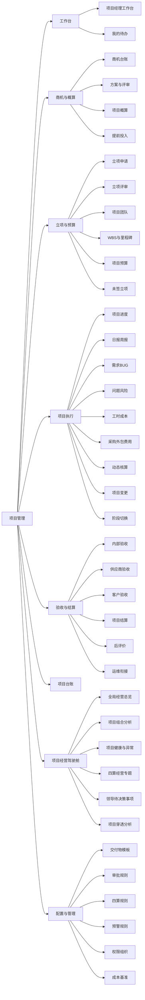
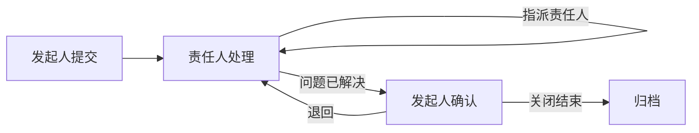

# 项目管理平台页面清单与原型设计说明

> **文档版本：** V1.1  
> **编制日期：** 2026-09-09  
> **上游文档：**《项目管理平台详细功能清单_V1.1_新增领导项目经营驾驶舱》  
> **业务主线：** 概算 → 预算 → 核算 → 结算  
> **使用目的：** 将功能清单进一步收敛为可直接进入 Axure / Figma 的页面级原型设计输入，明确页面、入口、信息结构、字段、按钮、状态、权限和关键交互。

---

# 1. 页面设计原则

## 1.1 页面模型

平台页面统一分为 6 类：

1. **工作台类**：面向角色的高频任务与异常聚合，例如项目经理工作台、管理驾驶舱。
2. **台账列表类**：集中查询、筛选、批量处理业务对象，例如商机台账、未签项目台账、项目问题台账。
3. **详情全景类**：围绕单个业务对象承载完整上下文，例如商机详情、项目详情。
4. **表单编制类**：完成新增、编制、变更等业务动作，例如概算编制、预算编制、变更申请。
5. **评审审批类**：聚合材料、意见、决策和流转，例如方案成本评审、立项决策、预算审批。
6. **专题分析类**：面向经营和管理分析，例如动态核算、四算对比、项目经营分析。

## 1.2 页面设计约束

- 同一业务对象尽量采用“**列表 → 详情 → 操作抽屉/表单**”模式，减少页面跳转。
- 项目详情作为单项目统一入口，禁止成本、进度、问题、文档分别形成互不关联的信息孤岛。
- 关键业务动作必须带出当前项目上下文，不要求用户重复选择项目。
- 已形成基线或已进入审批的数据，以“版本化修改”代替直接覆盖。
- 所有判断类规则均展示“命中原因”，例如为什么进入 PMC 审批、为什么预算超概算、为什么不能切换阶段。
- 风险、问题、成本偏差、里程碑逾期采用统一状态语言，避免同一风险在不同模块中出现不同定义。

---

# 2. 产品信息架构建议



---

# 3. 页面总清单

> 页面编号用于后续原型、需求、研发和测试追踪。建议 Axure/Figma 页面名称直接保留该编号。

| 页面编号 | 页面名称 | 页面类型 | 主要角色 | 对应功能范围 |
|---|---|---|---|---|
| WK-01 | 项目经理工作台 | 工作台 | 项目经理 | 核算阶段高频入口、项目异常、成本、进度、待办 |
| WK-02 | 我的待办中心 | 工作台/列表 | 全角色 | 审批、督办、阶段任务、预警待办 |
| GS-01 | 商机台账 | 台账列表 | 市场/项目主办部门 | GS-001~008 |
| GS-02 | 商机新建/编辑 | 表单 | 市场/项目主办部门 | GS-002~003 |
| GS-03 | 商机详情 | 详情全景 | 商机相关角色 | GS-004~008 |
| GS-04 | 商机初步评估 | 表单/评估 | 项目主办部门、方案、技术、财务 | GS-009~015 |
| GS-05 | 需求调研与解决方案 | 详情/编制 | 解决方案、技术、市场 | GS-016~020 |
| GS-06 | 技术与成本评估 | 编制 | 技术、方案、财务、采购 | GS-021~026 |
| GS-07 | 方案与成本专家评审 | 评审 | PMO、专家组 | GS-027~031 |
| GS-08 | 项目概算编制 | 编制 | 解决方案、财务 | GS-032~036 |
| GS-09 | 概算版本对比 | 专题 | 解决方案、财务、PMO | GS-035~036 |
| GS-10 | 提前投入申请 | 表单 | 项目主办部门 | GS-037~040 |
| GS-11 | 提前投入台账 | 台账 | PMO、财务、主办部门 | GS-040~042 |
| YS-01 | 立项申请 | 表单 | 项目主办部门 | YS-001~006 |
| YS-02 | 立项评审工作台 | 评审 | PMO、专家、职能部门 | YS-007~016 |
| YS-03 | 综合风险评估 | 专题/评估 | PMO、专家组 | YS-009 |
| YS-04 | 立项决策详情 | 评审详情 | PMO、PMC、管理层 | YS-010~016 |
| YS-05 | 项目团队 | 详情/配置 | 项目经理、交付部门、PMO | YS-017~021 |
| YS-06 | WBS计划编制 | 编制 | 项目经理、技术经理 | YS-022~027 |
| YS-07 | 里程碑计划 | 编制/列表 | 项目经理、PMO | YS-028~030 |
| YS-08 | 计划评审 | 评审 | PMO、交付部门 | YS-030 |
| YS-09 | 项目预算编制 | 编制 | 项目经理 | YS-031~040 |
| YS-10 | 概算预算对比 | 专题 | 项目经理、PMO、财务 | YS-038~043 |
| YS-11 | 预算审批详情 | 评审 | PMO、财务、管理层 | YS-041~043 |
| YS-12 | 项目基线 | 详情/版本 | PMO、项目经理 | YS-044~046 |
| YS-13 | 未签立项台账 | 台账 | PMO、财务、主办部门 | YS-047~054 |
| YS-14 | 未签项目详情 | 详情 | PMO、主办部门、财务 | YS-048~054 |
| YS-15 | 项目启动确认 | 表单/校验 | 项目经理、PMO | YS-055~057 |
| HS-01 | 项目详情总览 | 详情全景 | 项目成员及管理角色 | 项目全生命周期统一入口 |
| HS-02 | 项目进度 | 详情/计划 | 项目经理、项目成员 | 进度、WBS、里程碑、偏差 |
| HS-03 | 项目日报 | 列表/表单 | 项目经理 | 日报填报、进展、里程碑、问题风险 |
| HS-04 | 项目周报 | 列表/表单 | 项目经理 | 周度进展汇总、计划、风险 |
| HS-05 | 需求BUG台账 | 台账 | 项目经理、产品/技术责任人 | 需求与BUG闭环 |
| HS-06 | 需求BUG详情 | 流程详情 | 发起人、责任人 | 提交→解决/转办→确认→关闭 |
| HS-07 | 问题风险台账 | 台账 | 项目经理、PMO | 风险、问题分级、跟踪、升级 |
| HS-08 | 问题风险详情 | 流程详情 | 项目经理、责任人、PMO | 督办、反馈、升级、关闭 |
| HS-09 | 工时与人力成本 | 专题 | 项目经理、项目成员、财务 | 工时、预算、实际人力成本 |
| HS-10 | 采购成本 | 专题/列表 | 项目经理、采购、财务 | 采购申请、合同、到货、成本归集 |
| HS-11 | 外包成本 | 专题/列表 | 项目经理、采购、技术 | 外包申请、合同、履约、成本归集 |
| HS-12 | 项目费用 | 专题/列表 | 项目经理、财务 | 差旅、第三方、租房、业务等费用 |
| HS-13 | 动态核算 | 专题分析 | 项目经理、财务、PMO | 预算 vs 实际、滚动成本、偏差 |
| HS-14 | 项目变更台账 | 台账 | 项目经理、项目主办部门、PMO | 范围/计划/预算等变更 |
| HS-15 | 项目变更申请 | 表单 | 项目经理/项目主办部门 | 变更影响评估与审批 |
| HS-16 | 阶段切换申请 | 表单/校验 | 项目经理 | 里程碑达成、交付物、阶段门 |
| HS-17 | 阶段交付物 | 列表/文档 | 项目经理、PMO | 阶段交付物上传、审核、归档 |
| JS-01 | 内部验收 | 表单/评审 | 项目经理、交付/技术/测试 | 内部交付条件、质量检查、整改 |
| JS-02 | 供应商验收 | 表单/评审 | 采购、项目经理、专家 | 履约验收、整改 |
| JS-03 | 客户验收 | 表单/流程 | 项目经理、项目主办部门 | 验收准备、客户验收、整改、报告 |
| JS-04 | 项目报验 | 表单 | 项目经理 | 报验类型、金额、分税点、验收材料 |
| JS-05 | 项目结算申请 | 表单 | 项目主办部门、项目经理 | 结算条件校验、结算提交 |
| JS-06 | 项目结算详情 | 专题/审批 | 财务、PMO、项目主办部门 | 实际成本、收支核算、评审、整改 |
| JS-07 | 四算对比分析 | 专题分析 | PMO、财务、管理层 | 概算/预算/核算/结算横向对比 |
| JS-08 | 项目经营结果 | 专题分析 | 财务、经营管理、管理层 | 毛利、收入、成本、回款、效益 |
| JS-09 | 项目后评价 | 表单/专题 | PMO、项目主办、项目经理 | 目标达成、质量、成本、经验教训 |
| JS-10 | 项目资料归档 | 文档 | PMO、综合部、项目经理 | 资料归档、经验沉淀 |
| JS-11 | 运维衔接 | 表单/详情 | 项目经理、运维团队 | 运维交接、服务期、责任人 |
| JS-12 | 运维项目详情 | 详情 | 运维团队、主办部门 | 监控、问题、客户沟通、续约 |
| JS-13 | 项目关闭 | 表单/校验 | PMO、项目主管部门 | 关闭条件、最终归档 |
| GL-01 | 项目经营驾驶舱 | 工作台/分析 | 管理层、PMO | 全局项目规模、经营、健康度、异常与待决策事项 |
| GL-02 | 四算经营专题 | 专题分析 | 管理层、PMO、财务 | 概算→预算→核算→结算、毛利与成本偏差 |
| GL-03 | 项目穿透分析 | 专题分析 | 管理层、PMO | 从集团/部门/指标下钻至项目及原始业务明细 |
| GL-04 | 项目组合分析 | 专题分析 | 管理层、PMO | 按组织、区域、类型、等级、客户、行业分析项目组合 |
| GL-05 | 项目异常中心 | 台账/分析 | 管理层、PMO | 高风险、进度、成本、毛利、回款、未签投入异常 |
| GL-06 | 领导待决策事项 | 工作台/列表 | 管理层、PMO | 重大变更、超概算、重大风险、未签超限、验收结算异常 |
| CF-01 | 交付物模板配置 | 配置 | PMO/管理员 | 项目类型、阶段、必交文档配置 |
| CF-02 | 项目分级规则 | 配置 | PMO/管理员 | 项目金额、战略属性、风险分级 |
| CF-03 | 审批规则配置 | 配置 | PMO/管理员 | 会签、PMO、PMC、管理层路径 |
| CF-04 | 四算科目与映射 | 配置 | 财务/管理员 | 概算、预算、核算、结算科目映射 |
| CF-05 | 成本基准配置 | 配置 | 财务/人资/管理员 | 人力成本、费用标准等 |
| CF-06 | 预警规则配置 | 配置 | PMO/管理员 | 里程碑、成本、未签、风险等提醒 |
| CF-07 | 项目权限配置 | 配置 | 管理员 | 项目角色、数据范围、敏感字段 |
| CF-08 | 操作审计日志 | 查询 | 管理员/审计 | 关键数据及流程操作留痕 |

---

# 4. 核心页面原型规格

以下页面建议优先进入高保真原型。它们决定了整个系统的交互骨架。

## 4.1 WK-01 项目经理工作台

### 页面目标

让项目经理打开系统后，无需逐个模块查询，即可判断：**今天要处理什么、哪个项目有风险、哪里超预算、哪个里程碑要到期。**

### 页面结构

1. 顶部：快捷操作区
2. 我的项目：我负责 / 我参与
3. 异常与待处理事项
4. 项目进度与里程碑
5. 成本情况
6. 问题 / 风险 / 需求 / BUG
7. 近期验收及回款事项

### 快捷操作

- 采购申请
- 外包申请
- 费用申请
- 项目变更
- 预算变更
- 阶段切换
- 项目报验
- 项目结算
- 提问题
- 提风险
- 提需求
- 提 BUG

### 项目列表核心字段

| 字段 | 说明 |
|---|---|
| 项目编号 | 唯一项目编码，可点击进入 HS-01 |
| 项目名称 | 项目名称 |
| 项目金额 | 合同/立项金额 |
| 合同验收日期 | 合同要求日期 |
| 计划验收日期 | 当前有效基线计划日期 |
| 当前阶段 | 立项、实施、初验、试运行、待终验、维保等 |
| 整体完成率 | 来自进度计划/日报 |
| 问题数 | 未关闭问题 |
| 风险数 | 未释放风险 |
| BUG数 | 未关闭 BUG |
| 需求数 | 未关闭需求 |
| 预算成本 | 当前有效预算 |
| 已用成本 | 当前实际发生成本 |
| 成本偏差 | 预算 - 已用/滚动成本 |
| 人力预算 | 人力成本预算 |
| 已用人力成本 | 工时折算实际成本 |

### 交互规则

- 点击项目名称进入项目详情。
- 点击问题/风险/BUG/需求数字，直接以该项目为筛选条件进入对应台账。
- 成本偏差超过规则阈值时以异常状态展示，并提供“查看动态核算”。
- 临近里程碑到期显示提醒；已逾期显示超期状态。
- 不允许工作台直接修改核心业务数据，所有修改进入对应业务页。

---

## 4.2 GS-01 商机台账

### 查询区

- 商机编号
- 商机名称
- 客户名称
- 项目主办部门
- 商机负责人
- 区域
- 业务线
- 商机状态
- 预计金额区间
- 预计签约日期
- 是否拟立项
- 是否存在提前投入

### 列表字段

商机编号、商机名称、客户、负责人、主办部门、预计金额、预计签约日期、商机状态、综合评估结论、概算金额、提前投入金额、最后跟进时间。

### 页面按钮

- 新建商机
- 导出
- 保存筛选方案

### 行级操作

- 查看
- 编辑
- 发起评估
- 暂缓
- 终止
- 发起立项（满足条件后）

### 状态建议

`待评估 → 跟进中 → 暂缓 / 拟立项 / 终止`

---

## 4.3 GS-03 商机详情

### 页头

展示商机名称、商机编号、客户、负责人、预计金额、当前状态、预计签约日期。

### 页签

1. 概览
2. 跟进记录
3. 商机评估
4. 需求与方案
5. 技术成本评估
6. 专家评审
7. 项目概算
8. 提前投入
9. 操作记录

### 概览关键区域

- 商机基础信息
- 转立项条件完成度
- 当前方案版本
- 当前概算
- 预估毛利
- 主要风险
- 提前投入金额 / 已使用金额
- 最近一次评审结论

### 关键交互

“发起立项”按钮仅在系统校验转立项条件全部满足后可用；否则按钮置灰并显示缺失条件列表。

---

## 4.4 GS-04 商机初步评估

### 评估维度

- 客户价值
- 技术可行性
- 商务风险
- 竞争态势
- 交付难度
- 收益与毛利

### 字段设计

每个维度支持：评分、结论、风险项、说明、附件。

### 页面底部

系统自动形成：

- 综合评分
- 风险等级
- 建议动作：继续推进 / 暂缓 / 终止 / 拟立项
- 不满足项提示

### 权限

不同专业角色仅编辑自己负责的评估维度；项目主办部门可查看汇总，不得修改其他专业意见。

---

## 4.5 GS-08 项目概算编制

### 页面页签

1. 概算总览
2. 收入
3. 建设成本
4. 人力成本
5. 第三方费用
6. 期间费用
7. 风险成本
8. 毛利分析
9. 版本记录

### 核心字段

科目、来源、数量、单价、金额、税率/口径、测算依据、责任部门、风险说明。

### 页面规则

- 成本科目必须来自统一四算科目字典。
- 专家评审通过后方可冻结为正式概算。
- 冻结概算进入立项输入后不得直接覆盖。
- 方案范围变化时提示重新评估概算影响。

---

## 4.6 YS-01 立项申请

### 页面页签

1. 基本信息
2. 商机承接
3. 概算与毛利
4. 风险信息
5. 项目交付信息
6. 交付物目录
7. 附件

### 关键字段

项目名称、关联商机、客户、项目类型、项目金额、主办部门、业务经理、合同状态、预计签约日期、项目等级建议、方案版本、概算版本、预期毛利、主要风险。

### 交付物目录

系统根据“项目类型 + 项目等级”自动生成全周期文档目录：

- 阶段
- 交付物名称
- 是否必须
- 提交时点
- 责任角色

PMO 可将“非必须”调整为“必须”，但不允许将系统规则指定的“必须”改为非必须。

### 提交前校验

- 商机是否达到拟立项
- 方案是否通过评审
- 概算是否冻结
- 必要风险信息是否完整
- 立项附件是否完整

---

## 4.7 YS-02 立项评审工作台

### 页面结构

左侧：立项项目列表；右侧：当前项目评审工作区。

### 评审工作区

- 项目摘要
- 项目分级依据
- 毛利及概算
- 综合风险报告
- 方案 / 技术意见
- 财务意见
- 法务意见
- 交付意见
- 审批路径判断

### 系统提示

明确展示：

> 当前项目命中“重大 / 高风险项目”规则，因此进入 PMC 重大项目决策会。

而不是只展示“当前审批节点：PMC”。

### 决策动作

- 通过
- 整改
- 否决
- 暂缓

整改时必须填写整改事项、责任人、要求完成时间。

---

## 4.8 YS-06 WBS计划编制

### 页面布局

推荐使用“树形任务 + 甘特图”的左右结构。

### 任务字段

任务名称、层级、责任人、计划开始、计划结束、工期、计划工时、前置任务、完成条件、对应里程碑、说明。

### 核心规则

- 支持 Excel 导入。
- 不允许循环依赖。
- 最小工作包必须明确责任人和日期。
- 正式基线生效后禁止直接修改；点击编辑时提示进入项目变更。
- 一级里程碑按项目类型加载标准模板。

---

## 4.9 YS-09 项目预算编制

### 页面页签

1. 项目基本信息
2. 进度计划
3. 建设成本
4. 交付人力成本
5. 交付期间费用
6. 第三方费用
7. 外包预算
8. 预算汇总
9. 概算对比
10. 毛利分析

### 交付人力成本

按阶段/任务填写：角色、人员/岗位、职级、计划人天、出差天数、成本单价、预计成本。

### 页面顶部固定指标

- 概算总成本
- 当前预算总成本
- 差异额
- 差异率
- 概算毛利率
- 预算毛利率
- 是否超概算

### 提交规则

若预算超过概算，不阻断用户保存，但提交时进入“超概算审批路径”，并要求填写超概算原因。

---

## 4.10 YS-13 未签立项台账

### 核心目标

解决“项目已投入，但客户合同尚未签订”的风险敞口问题。

### 字段

项目编号、项目名称、立项金额、立项日期、预计签约日期、未签持续天数、批准投入额度、已投入成本、额度使用率、最近签约进展、责任人、风险状态。

### 异常标签

- 签约临期
- 签约逾期
- 投入接近限额
- 投入超限
- 长期未签

### 行操作

- 查看详情
- 更新签约进展
- 申请额外投入
- 确认合同签订
- 发起退出复盘

---

## 4.11 HS-01 项目详情总览

### 产品定位

这是平台最核心的“单项目驾驶舱”。所有业务模块都应能从这里进入，并保持统一项目上下文。

### 页头固定信息

项目编号、项目名称、客户、项目经理、业务经理、当前阶段、项目状态、合同金额、预算成本、实际成本、预计毛利、计划验收日期。

### 页签

1. 项目概览
2. 团队
3. 计划进度
4. 四算
5. 成本
6. 日报周报
7. 问题风险
8. 需求BUG
9. 采购外包
10. 变更
11. 交付物
12. 验收结算
13. 回款
14. 操作记录

### 项目概览

采用“指标 + 关键时间线 + 异常事项 + 最近动态”的方式，而不是把全部字段平铺。

---

## 4.12 HS-02 项目进度

### 页面区域

- 项目总体完成率
- 当前里程碑
- 下一里程碑
- 里程碑时间轴
- WBS 甘特图
- 超期任务
- 计划与实际偏差

### 里程碑状态

- 未开始
- 进行中
- 临期
- 已逾期
- 已达成
- 已变更

### 关键操作

- 查看 WBS
- 更新任务进度
- 填写实际完成时间
- 发起计划变更
- 发起阶段切换

---

## 4.13 HS-03 项目日报

### 自动生成机制

项目进入执行状态后，系统按规则自动生成日报待办，项目经理无需手工创建。

### 表单区域

1. 项目基本信息（系统带入）
2. 整体完工比例
3. 当天是否有进展
4. 最新进展
5. 明日/下一步计划
6. 里程碑更新
7. 问题/风险新增
8. 交付物更新

### 关键交互

- “当天无进展”时允许简化提交，但需保留原因字段。
- 里程碑完成时要求填写实际完成时间和必要附件。
- 新建问题/风险使用独立业务对象，日报仅作为入口和关联载体，不将问题生命周期绑死在日报中。

---

## 4.14 HS-05 需求BUG台账

### 筛选项

类型（需求/BUG）、项目、优先级、处理状态、是否超期、责任人、发起人、期望解决时间、实际解决时间。

### 核心流程



### 关键规则

- 类型为需求时展示产品行业线、产品名称；BUG 不展示。
- 指派责任人由用户手动选择。
- 责任人可转办，转办后责任人字段同步变化。
- 发起人是最终关闭人。
- 历史处理过程保留时间线，不允许删除。

---

## 4.15 HS-07 问题风险台账

### 列表字段

项目、类型（问题/风险）、等级、分类、标题、责任人、要求解决时间、当前进展、是否超期、升级层级、创建时间、关闭时间。

### 问题等级

- 一般：不实质影响整体交付，可在项目/铁三角内部处理。
- 重要：影响整体交付，需要部门或管理层协调资源。
- 重大：可能导致停滞、违约、重大客户影响，需要 PMO/管理层介入。

### 风险转问题

风险发生后支持“转为问题”，保留原风险记录并建立关联关系，不直接覆盖。

---

## 4.16 HS-13 动态核算

### 页面定位

核算不是一张“财务结果表”，而是项目执行过程中的成本驾驶舱。

### 顶部指标

- 预算总成本
- 已发生成本
- 已承诺未发生成本
- 实时滚动成本
- 剩余预算
- 执行率
- 预计总成本
- 预计毛利率

### 成本分组

- 建设成本
- 采购
- 外包
- 人力
- 第三方费用
- 差旅
- 租房
- 业务费用
- 其他费用

### 关键分析

| 指标 | 建议口径 |
|---|---|
| 已发生成本 | 已实际确认发生的成本 |
| 已承诺成本 | 已签采购/外包等合同但尚未全部发生的成本 |
| 实时滚动成本 | 已发生 + 已承诺/预计发生 |
| 预算执行率 | 已发生 / 当前有效预算 |
| 滚动偏差率 | （滚动成本 - 当前预算）/ 当前预算 |

### 操作

异常成本点击后可下钻到采购、外包、工时、费用等来源单据。

---

## 4.17 HS-15 项目变更申请

### 变更类型

- 范围变更
- 进度变更
- 预算变更
- 资源变更
- 合同相关变更
- 综合变更

### 变更表单

变更原因、变更内容、客户依据/签证、原基线、目标基线、影响范围、进度影响、成本影响、毛利影响、采购影响、外包影响、风险、附件。

### 页面交互

变更前后采用左右对比：

> 原计划验收：2026-11-30 → 新计划验收：2027-01-15  
> 原预算：500 万 → 新预算：560 万

审批通过后自动生成新基线版本，不覆盖历史版本。

---

## 4.18 HS-16 阶段切换申请

### 页面目标

将“项目经理认为完成”变成“系统验证 + PMO确认后完成阶段切换”。

### 表单字段

项目、当前阶段、目标阶段、对应里程碑、计划完成时间、实际完成时间、说明。

### 系统自动校验

- 里程碑是否已达成
- 该阶段必交交付物是否齐全
- 是否存在禁止切换的重大异常
- 是否需要内部验收/客户验收材料

### 校验区示例

| 条件 | 状态 |
|---|---|
| 完工里程碑已完成 | ✅ |
| 完工报告已上传 | ✅ |
| 项目实施计划已归档 | ✅ |
| 当前存在重大未关闭问题 | ⚠️ 需说明 |

---

## 4.19 JS-03 客户验收

### 页面结构

1. 验收准备清单
2. 验收材料
3. 客户验收信息
4. 验收问题
5. 验收结果
6. 验收报告/确认函

### 状态

`准备中 → 待验收 → 验收整改 → 验收通过`

### 规则

验收未通过时保留本次验收记录，新一轮验收形成新的验收轮次，不覆盖第一次结果。

---

## 4.20 JS-05 项目结算申请

### 发起条件校验

系统展示三类条件：

1. 最终验收/正式验收已经完成；
2. 需锁定的建设成本、费用成本、人力成本已完成发生；
3. 项目未执行过最终结算。

全部通过才开放提交按钮。

### 页面内容

- 项目基础信息
- 验收信息
- 合同收入
- 实际成本汇总
- 回款情况
- 待处理成本事项
- 结算附件

### 提交后

冻结建设期相关成本入口，并进入财务核算 / PMO结算评审。

---

## 4.21 JS-07 四算对比分析

### 页面结构

顶部：收入、成本、毛利核心指标。

主体表格：

| 成本科目 | 概算 | 预算 | 核算 | 结算 | 概算→预算差异 | 预算→结算差异 |
|---|---:|---:|---:|---:|---:|---:|
| 人力成本 |  |  |  |  |  |  |
| 采购成本 |  |  |  |  |  |  |
| 外包成本 |  |  |  |  |  |  |
| 第三方费用 |  |  |  |  |  |  |
| 期间费用 |  |  |  |  |  |  |

### 分析维度

- 金额差异
- 差异率
- 差异原因
- 责任阶段
- 主要变更来源

### 产品原则

四算分析不是四张表简单并排，应支持回答：

- 为什么预算比概算高？
- 实际执行为什么超预算？
- 最终结算和预算差异来自哪些科目？
- 哪一次项目变更造成主要成本变化？

---

## 4.22 GL-01 项目经营驾驶舱

### 页面目标

面向集团领导、业务群/事业部负责人、交付负责人、PMO 管理层提供全局项目经营视角。

页面必须能够在一屏内帮助管理者回答：

1. 当前项目盘子有多大；
2. 项目组合整体赚不赚钱；
3. 哪些项目存在重大异常；
4. 异常为什么发生；
5. 哪些事项需要当前管理者做决策或协调。

页面设计遵循：

> **全局概览 → 异常识别 → 原因分析 → 项目穿透 → 管理决策**

而不是“图表越多越好”。

### 访问角色与默认数据范围

| 角色 | 默认范围 |
|---|---|
| 集团领导 | 全集团 |
| 业务群/事业部负责人 | 本组织 |
| 交付负责人 | 本交付体系 |
| PMO负责人 | 管辖项目 |
| 部门负责人 | 本部门 |
| 项目总监 | 所管辖项目 |

同一页面根据权限自动改变统计范围，不针对不同领导重复建设多套看板。

### 页面整体布局

建议采用：

```text
┌─────────────────────────────────────────────────────────┐
│ 项目经营驾驶舱                                           │
│ 组织 / 区域 / 类型 / 等级 / 行业 / 客户 / 时间 / 健康度  │
├─────────────────────────────────────────────────────────┤
│ 核心经营KPI                                             │
│ 项目规模 | 合同 | 预算 | 滚动成本 | 预测毛利 | 回款      │
├──────────────────────────┬──────────────────────────────┤
│ 四阶段项目分布           │ 项目健康度                    │
│ 概算/预算/核算/结算       │ 健康/关注/预警/高风险          │
├──────────────────────────┴──────────────────────────────┤
│ 经营与执行分析                                           │
│ 进度 | 成本 | 毛利 | 回款 | 四算偏差                     │
├────────────────────────────────────┬────────────────────┤
│ 重点异常项目                        │ 待决策/待关注        │
│ 高风险/延期/成本/毛利/回款/未签      │ 重大变更/风险等       │
└────────────────────────────────────┴────────────────────┘
```

### 顶部全局筛选

至少包括：

- 组织；
- 区域；
- 项目类型；
- 项目等级；
- 行业；
- 客户；
- 项目经理/项目总监；
- 时间范围；
- 项目健康度。

支持：

- 查询；
- 重置；
- 保存常用视图；
- 恢复默认视图。

筛选条件应自动带入后续所有下钻页面。

### 第一屏核心KPI

#### 项目规模

- 在管项目数 / 金额；
- 在建项目数 / 金额；
- 未签立项项目数 / 金额；
- 验收收尾项目数 / 金额；
- 运维项目数 / 金额。

#### 经营

- 合同总额；
- 概算成本；
- 预算成本；
- 已发生成本；
- 实时滚动成本；
- 预算毛利；
- 当前预测毛利；
- 当前预测毛利率；
- 毛利偏差。

#### 回款

- 应收金额；
- 已回款金额；
- 逾期金额；
- 回款完成率。

所有KPI卡必须支持点击下钻项目清单，而不是纯展示。

### 项目健康度

统一状态：

`健康 / 关注 / 预警 / 高风险`

健康度至少综合：

- 进度；
- 成本；
- 毛利；
- 回款；
- 风险问题；
- 未签投入/阶段合规。

点击某一健康状态后进入 GL-05 项目异常中心，并自动带入筛选条件。

项目列表中必须能够查看“健康度原因”，例如：

> 高风险：终验延期52天；滚动成本超预算18%；存在1个重大问题。

### 四阶段分布

按：

`概算 / 预算 / 核算 / 结算及运维`

展示：

- 项目数量；
- 项目金额；
- 各组织占比。

支持点击阶段进入对应项目清单。

### 经营与执行分析区

建议使用 Tab 控制，不把所有图表堆在一屏：

`进度 | 成本 | 毛利 | 回款 | 四算`

#### 进度

- 逾期项目趋势；
- 里程碑临期/逾期；
- 验收延期 TOP。

#### 成本

- 预算 vs 已发生；
- 预算 vs 滚动预测；
- 超预算 TOP。

#### 毛利

- 预算毛利率 vs 预测毛利率；
- 毛利下降 TOP；
- 按组织/项目类型分析毛利。

#### 回款

- 应收/实收；
- 回款逾期；
- 回款完成率。

#### 四算

直接关联 GL-02 四算经营专题。

### 重点异常项目

异常清单默认展示：

- 高风险项目 TOP；
- 进度延期 TOP；
- 成本超支 TOP；
- 毛利下降 TOP；
- 回款异常 TOP；
- 未签投入异常 TOP。

核心字段：

| 字段 | 说明 |
|---|---|
| 项目名称 | 点击进入 HS-01 |
| 项目金额 | 判断异常影响规模 |
| 所属组织 | 项目归属 |
| 当前阶段 | 当前生命周期阶段 |
| 健康度 | 健康/关注/预警/高风险 |
| 主要异常 | 系统自动汇总1~3项 |
| 预测毛利偏差 | 相对预算变化 |
| 进度偏差 | 当前延期情况 |
| 项目经理/总监 | 当前责任角色 |
| 异常持续时间 | 首次触发至当前 |

### 待决策/待关注

右侧固定展示当前用户需要关注或处理的事项，例如：

- 重大项目变更待决策；
- 超概算/重大预算事项；
- 重大风险待协调；
- 未签投入超限；
- 重大验收异常；
- 重大结算异常。

单条事项展示：

- 项目；
- 事项类型；
- 影响金额；
- 影响摘要；
- 当前责任人；
- 等待时长；
- 建议动作。

点击进入 GL-06 或原业务审批详情。

### 下钻链路

标准链路：

> 集团 → 业务群/部门 → 项目列表 → HS-01 项目详情 → 异常原因 → 原业务单据/成本明细。

示例：

> 成本超预算项目12个 → A项目 → 采购成本超80万 → 采购合同明细。

返回上一层时保留筛选条件与滚动位置。

### 页面状态

至少支持：

- 正常数据态；
- 部分数据源延迟；
- 无数据；
- 无权限；
- 指标计算中；
- 指标口径变更提示。

### 数据更新时间

页面显著位置显示：

> 数据更新至：2026-09-09 18:30

如不同数据源更新时间不同，可在指标详情中展示具体更新时间。

### 页面产品边界

驾驶舱负责：

- 看全局；
- 找异常；
- 看原因；
- 下钻；
- 进入决策。

不负责直接完成项目经理的计划、成本、采购、外包等业务维护。

---

## 4.23 GL-04 项目组合分析

### 页面目标

用于从集团项目组合视角比较不同组织、区域、项目类型、等级、行业、客户的项目规模与经营表现。

### 核心分析维度

- 组织；
- 区域；
- 项目类型；
- 项目等级；
- 行业；
- 客户；
- 项目经理/项目总监。

### 核心指标

- 项目数量；
- 项目金额；
- 预算金额；
- 滚动成本；
- 预测毛利；
- 预测毛利率；
- 高风险项目数；
- 逾期项目数；
- 回款完成率。

支持多层级下钻：

> 集团 → 业务群 → 部门 → 项目。

---

## 4.24 GL-05 项目异常中心

### 页面目标

将领导驾驶舱中的所有异常项目集中到统一台账，成为管理层的“重点项目清单”。

### 顶部异常Tab

`全部 / 高风险 / 进度异常 / 成本异常 / 毛利异常 / 回款异常 / 未签异常`

### 核心字段

- 项目编号；
- 项目名称；
- 项目金额；
- 所属组织；
- 当前阶段；
- 健康度；
- 主要异常；
- 异常触发时间；
- 持续时长；
- 预测成本偏差；
- 预测毛利偏差；
- 项目经理；
- 项目总监。

### 行操作

- 查看项目；
- 查看健康度原因；
- 查看异常明细；
- 查看责任链。

不在该页面直接修改业务数据。

---

## 4.25 GL-06 领导待决策事项

### 页面目标

将需要管理层审批、决策、协调的项目事项统一聚合，减少领导在不同业务模块中寻找待处理事项。

### 事项类型

- 重大变更；
- 超概算/重大预算；
- 重大风险；
- 未签投入超限；
- 重大验收异常；
- 重大结算异常。

### 列表字段

- 事项编号；
- 事项类型；
- 项目；
- 项目金额；
- 影响金额；
- 影响摘要；
- 当前节点；
- 发起人/责任人；
- 发起时间；
- 等待时长；
- 建议动作。

### 页面动作

- 查看事项；
- 查看项目全景；
- 进入原审批；
- 查看历史决策。

驾驶舱只聚合，不复制原审批表单和审批规则。

---


# 5. 通用页面规范

## 5.1 列表页统一能力

所有台账类页面默认提供：

- 组合筛选
- 快速搜索
- 排序
- 列显示配置
- 保存查询方案
- 导出
- 分页
- 权限范围提示
- 行点击进入详情

对于业务状态较多的台账，可增加顶部状态 Tab，例如：

`全部 / 待处理 / 处理中 / 已超期 / 已关闭`

## 5.2 详情页统一能力

所有详情页建议采用：

**页头摘要 + 状态 + 主要操作按钮 + 页签 + 时间线/操作记录**。

关键业务字段修改必须能在时间线看到“谁、什么时候、从什么改成什么”。

## 5.3 审批页统一能力

审批页统一包含：

1. 业务摘要
2. 关键指标
3. 规则命中结果
4. 申请材料
5. 历史审批意见
6. 当前审批意见
7. 审批动作

审批动作必须区分：通过、退回整改、否决；不能只有“同意/不同意”而缺少业务语义。

## 5.4 状态展示统一规范

建议业务状态与视觉状态解耦：

- 正常：无风险
- 提醒：临期 / 轻度偏差
- 警告：超期 / 明显偏差
- 严重：重大问题 / 超预算 / 流程阻断
- 完成：已验收 / 已关闭 / 已结算

---

# 6. 权限设计建议

## 6.1 权限维度

平台权限至少拆为：

- 菜单权限
- 页面权限
- 操作权限
- 数据范围权限
- 项目内角色权限
- 字段级权限

## 6.2 敏感字段

以下字段建议支持字段级可见性控制：

- 毛利 / 毛利率
- 人力成本基准
- 采购成本
- 外包成本
- 项目经营结果
- 专家评审意见
- 管理层决策意见

## 6.3 项目权限继承

项目角色变化时，权限同步变化：

- 成员加入项目 → 获得对应项目访问权限
- 成员退出项目 → 收回业务编辑权限，历史责任记录仍保留
- 项目经理变更 → 原项目经理保留历史操作记录，新项目经理获得当前管理权限

---

# 7. 原型制作顺序建议

为了避免一次性铺开全部页面导致返工，建议分 4 轮进行。

## 第一轮：先定骨架

优先完成：

1. WK-01 项目经理工作台
2. HS-01 项目详情总览
3. GS-01 商机台账
4. GS-03 商机详情
5. YS-01 立项申请
6. YS-09 项目预算编制
7. HS-13 动态核算
8. GL-01 项目经营驾驶舱

这一轮解决导航、页面结构、核心数据布局问题。

## 第二轮：打通概算和预算

完成 GS-04~GS-11、YS-02~YS-15，确保：

**商机 → 方案 → 概算 → 立项 → 团队 → WBS → 预算 → 基线 → 正式启动**

可以从头走通。

## 第三轮：打通执行闭环

完成 HS-02~HS-17，确保：

**计划 → 日报 → 工时 → 成本 → 问题风险 → 需求BUG → 变更 → 阶段切换**

形成统一执行链。

## 第四轮：打通验收结算

完成 JS-01~JS-13、GL-02~GL-06，确保：

**内部验收 → 客户验收 → 报验 → 结算 → 四算分析 → 后评价 → 运维/关闭**

形成最终生命周期闭环。

---

# 8. 下一层原型规格建议

进入实际画原型时，建议每个页面继续使用下面的固定模板：

```text
页面编号：
页面名称：
页面目标：
访问角色：
访问入口：
前置条件：

一、页面布局
二、查询条件
三、列表字段/表单字段
四、按钮及操作
五、状态及状态流转
六、字段联动
七、权限规则
八、异常提示
九、跳转关系
十、数据来源
十一、验收标准
```

后续研发、测试也可以直接复用该页面编号，建立：

**PRD功能编号 → 页面编号 → 接口 → 测试用例** 的完整追踪链路。

---

# 9. 本阶段输出结论

本页面清单将上游功能清单收敛为约 70+ 个产品页面，核心设计思想不是“一功能一个页面”，而是围绕业务对象和用户任务进行聚合：

- 商机围绕“商机详情”聚合售前全过程；
- 项目围绕“项目详情”聚合执行全过程；
- 项目经理围绕“工作台”聚合日常行动；
- 管理层围绕“项目经营驾驶舱”聚合项目组合、经营指标、健康异常与待决策事项；
- 概算、预算、核算、结算通过统一科目与版本机制形成连续数据链。

下一步即可进入**逐页面低保真原型规格**，优先建议从 `WK-01 项目经理工作台`、`HS-01 项目详情总览`、`YS-09 项目预算编制` 三个页面开始，因为这三个页面基本决定了后续所有页面的信息架构和交互风格。
